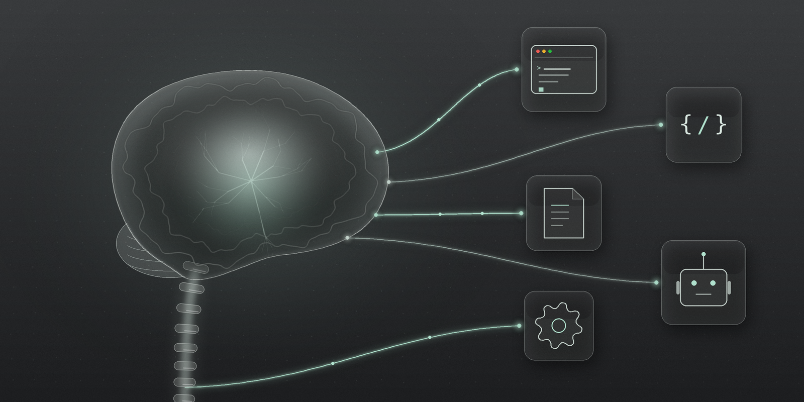
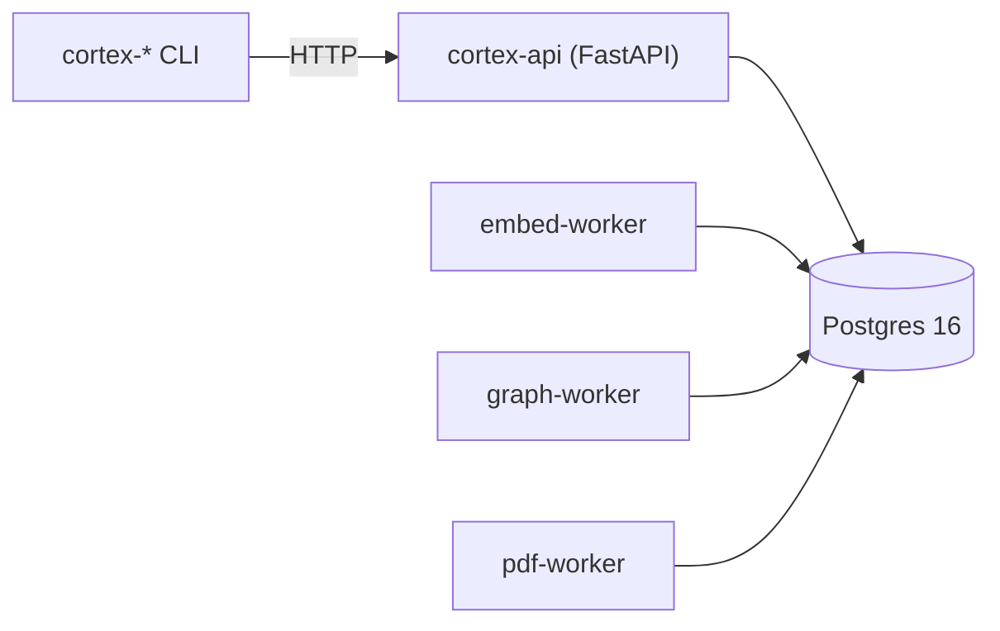

# Cortex

**Persistent memory and coordination for AI agent teams.** Postgres-backed. Built and
battle-tested inside [Kaidera OS](https://kaidera.ai), now becoming an independent
open-source product — the same path [OpenKai](https://github.com/Kaidera-AI/openkai) took.

> **Status: extraction in progress.** The code (≈21k lines of API, 79 CLI commands, ingest
> workers, migrations) runs in production inside Kaidera OS today and lands here as
> **v0.1.0**. This scaffold defines the contract it arrives under. Watch the repo or open a
> discussion if you want to shape it.

## What it does

Give a team of AI workers what a human team takes for granted:

- **Durable memory** — decisions, lessons and progress that survive the session, with
  embedding + graph enrichment and semantic / rerank / graph search over all of it.
- **Coordination** — handoffs with a claim/complete lifecycle, consult flows, and a
  state-aware CLI, so work moves between workers without a human relaying it.
- **Identity & registry** — projects, rosters, worker identity (`worker@project`), and boot
  context that tells an agent who it is and what is in flight.
- **Ingest** — documents, PDFs, session transcripts; enrichment runs as workers, not in the
  request path.
- **Operations that verify effects** — a doctor that checks retention *applied* and search
  *answers*, not that a config row exists.

## Architecture

Principles (each one paid for in production, not aspirational):

1. **Postgres is the only store.** No Redis, no second queue.
2. **API-only access** — every client, including the CLI, goes through HTTP.
3. **Verify the effect, never the declaration.**
4. **No-privilege runtime** — everything repairable as the owning user; no root, no
   password prompts, no OS-global state in the data path.
5. **Fail loud** — fresh deploys bootstrap their schema explicitly and receipt it.

## Standalone or embedded

Cortex runs **standalone** as a six-layer containerised appliance — `db` → `migrate` →
`cortex-api` → three enrichment workers — the memory system for any agent stack, on macOS
(Apple Container) or Linux (rootless podman). It also runs **inside Kaidera OS as a module**: each release ships a
versioned, hash-pinned artifact that the KOS appliance installs at image build. Same code,
two lives, one owner per fact.

## Docs

**Start here**
- [Install on macOS](docs/install-macos.md) (Apple Container) · [Install on Linux](docs/install-linux.md) (rootless podman)
- [Quickstart](docs/quickstart.md) *(the v0.1.0 target CLI — commands are live in Kaidera OS today)*
- [Discovery — how a project finds Cortex and learns what it can do](docs/discovery.md)

**Guides**
- [Create a project](docs/guides/create-a-project.md)
- [Multi-agent teams](docs/guides/multi-agent-teams.md) — identity, roles, the orchestrator
- [Handoffs](docs/guides/handoffs.md) — how work moves
- [Memory](docs/guides/memory.md) — decisions, lessons, search, retention
- [Ingest](docs/guides/ingest.md) · [Operations](docs/guides/operations.md)

**Models & providers**
- [Models — embeddings & rerank, the provider ladder](docs/models.md) (Ollama → NVIDIA free → OpenRouter)
- [Providers on a standalone Cortex](docs/providers-standalone.md) — subscriptions for your agents, API providers for enrichment

**Reference**
- [Functionality reference](docs/functionality/README.md) — one doc per functionality, built from real history
- [Architecture](docs/architecture.md) — the six-layer appliance
- [Deployment](docs/deployment.md)
- [Development & ways of working](docs/development.md)
- [Roadmap](ROADMAP.md)

## Contributing

See [CONTRIBUTING.md](CONTRIBUTING.md). The bar: every fix proves its test by breaking the
code, and a green suite is not evidence — behaviour is.

MIT. © 2026 Kaidera contributors.
