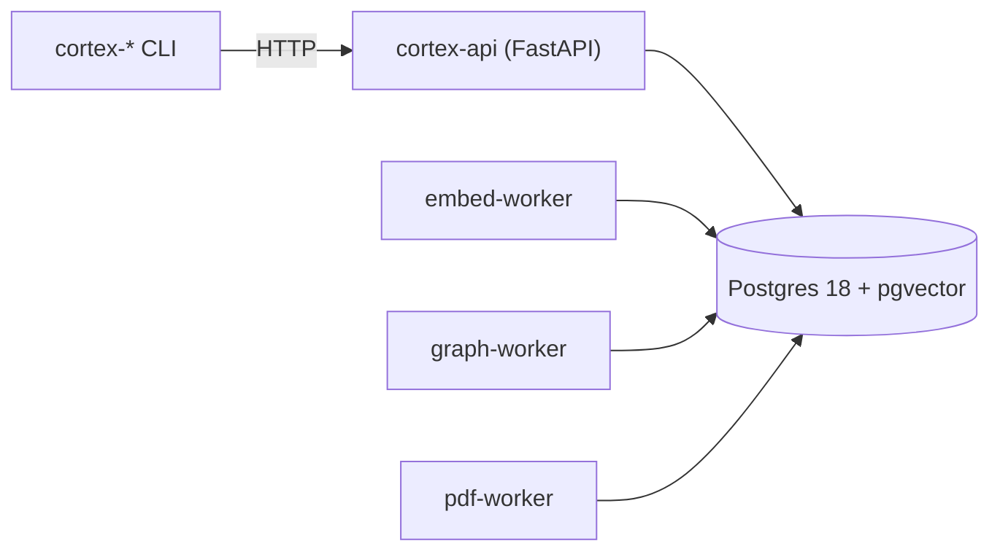

# Cortex


**Persistent memory and coordination for AI agent teams.** Postgres-backed. Built and
battle-tested inside [Kaidera OS](https://kaidera.ai), now an independent open-source
product — the same path [OpenKai](https://github.com/Kaidera-AI/openkai) took.

> **Status: v0.1.002 — a partial release (2026-09-09).** This is the actual codebase,
> projected from the Kaidera OS production lineage at the revision recorded in
> [`PROJECTION_MANIFEST.json`](PROJECTION_MANIFEST.json). The launcher (`cortex`) now
> installs through npm, bun and Homebrew — see [Installing the launcher](#installing-the-launcher).
> It has **not** been qualified on a fresh host by the release author: expect to fix things.
> What is known to work and what is known to be missing is listed under
> [Known gaps](#known-gaps-v01002). The full programme continues as v0.1.003 (complete) —
> see [ROADMAP.md](ROADMAP.md).

## What is in this repository

| Component | Path | Contents |
|---|---|---|
| API | `packages/api` | `cortex-api` (FastAPI, ~21k lines): memory, handoffs, registry, search, ingest, MCP server, TLS/auth custody helpers |
| CLI | `packages/cli` | 72 executable `cortex-*` commands (API-only; harness-coupled commands are not projected) |
| Schema | `packages/schema` | Postgres schema baseline + 90 forward-only migrations |
| Workers | `packages/containers` | `embed-worker`, `graph-worker`, `pdf-worker` (enrichment runs outside the request path) |
| Deploy | `packages/deploy` | compose file, `cortex-runtime` lifecycle launcher, DB/TLS/provider images, backup/restore, `release.json` |
| Installer | `packages/installer` | dependency-free Node launcher (`preflight`, `install`, `backup`, `restore`); published as `@kaidera/cortex` 0.1.2 on npm and as `cortex` in the `kaidera-ai/kaidera` Homebrew tap |

Every byte under `packages/` is produced by the committed projector in the source repository
from a pristine git archive of one revision; nothing is edited in place here. The manifest
binds the source revision and a tree hash per component.

## Engines

One containerisation technology per machine, latest stable:

- **Linux:** rootless Podman `>= 5.0` (the `>= 5.0` floor is a refusal line; Ubuntu 24.04's
  4.9.3 is too old) — [install guide](docs/install-linux.md).
- **macOS:** a rootless Podman machine (`applehv`), measured in production —
  [install guide](docs/install-macos.md). Apple Container was removed on 2026-09-01 and is
  not supported.

## Installing the launcher

The `cortex` launcher — the CLI that will deploy and manage the stack — installs today
through three channels, all wrapping the identical `bin/cortex.js`:

```sh
npx  @kaidera/cortex preflight --json      # npm (Node >= 18)
bunx @kaidera/cortex preflight --json      # bun (same package; CI-gated)
brew install kaidera-ai/kaidera/cortex && cortex preflight --json
```

`preflight` and `version` work now: `preflight` checks the host's container engine
(rootless Podman `>= 5.0`) and reports what is missing. `cortex install` does not yet —
see the next section.

## Running the stack — not yet from a published release

**There is still no published payload, so `cortex install` refuses.** The lifecycle
launcher is a *prebuilt-runtime* launcher: it acquires verified images from an image lock
and reads an install manifest, and refuses to build source images by design
(`packages/deploy/cortex-runtime`: "prebuilt runtime never builds source images"). Running
`cortex install` without `--payload` exits 2 with `cortex install: REFUSED — no published
digest-pinned release payload exists.` v0.1.002 ships the launcher and the release
*contract* (`packages/installer/README.md#release-contract`) that a payload must satisfy;
it does not yet ship a release archive, image lock, container images or a `--payload` you
can point at. That is v0.1.003 delivery work — see [ROADMAP.md](ROADMAP.md).

What you can do with this checkout (or the published launcher) today:

- read the code, the schema and the migrations;
- run the API unit tests (`packages/api/tests`, needs `mcp >= 2.1.1`; see gap 3 below);
- run the installer's offline tests (`cd packages/installer && npm test`);
- run `cortex preflight` against a real Podman host and see the real check results;
- inspect the deployment contract: `packages/deploy/docker-compose.yml`, the Containerfiles
  under `packages/api`, `packages/containers/*` and `packages/deploy`, and
  `python3 packages/deploy/cortex-runtime --help`.

Reports are welcome as issues; see [SECURITY.md](SECURITY.md) for anything sensitive.

## What it does

Give a team of AI workers what a human team takes for granted:

- **Durable memory** — decisions, lessons and progress that survive the session, with
  embedding + graph enrichment and semantic / rerank / graph search over all of it.
- **Coordination** — handoffs with a claim/return/complete lifecycle, consult flows, and a
  state-aware CLI, so work moves between workers without a human relaying it.
- **Identity & registry** — projects, rosters, worker identity (`worker@project`), and boot
  context that tells an agent who it is and what is in flight.
- **Ingest** — documents, PDFs, session transcripts; enrichment runs as workers, not in the
  request path.
- **Operations that verify effects** — a doctor that checks retention *applied* and search
  *answers*, not that a config row exists.

## Architecture



Principles (each one paid for in production, not aspirational):

1. **Postgres is the only store.** No Redis, no second queue.
2. **API-only access** — every client, including the CLI, goes through HTTP.
3. **Verify the effect, never the declaration.**
4. **No-privilege runtime** — everything repairable as the owning user; no root, no
   password prompts, no OS-global state in the data path.
5. **Fail loud** — fresh deploys bootstrap their schema explicitly and receipt it.

## Known gaps (v0.1.002)

Measured on the release revision, not inferred. Each item has an owner in the source
programme; none is waived.

1. **Not qualified on a fresh host.** Fresh boot, seeded upgrade, DB/config/PKI restore and
   launcher upgrade/rollback have not been demonstrated on this revision. A first external
   data point exists: on a clean Rocky Linux 10 host with Podman 5.8.2, the published
   launcher's `preflight` passes all six checks and `install` refuses correctly (exit 2, no
   payload) — that is the expected v0.1.002 behaviour, not a release-acceptance run.
2. **No published payload or images.** `cortex install` refuses without an explicit
   `--payload`; the launcher itself is now live on npm, bun and the Homebrew tap (see
   [Installing the launcher](#installing-the-launcher)), but no release archive, image lock
   or container images exist yet.
3. **API authentication and TLS are incomplete.** The API is meant to be reached on
   loopback only; the admin token is compared in plaintext; the TLS custody helpers
   (`api_tls.py`, `db_tls.py`) and the `cortex_auth` schema are present but not wired end to
   end. Do not expose the API beyond `127.0.0.1`.
4. **MCP over HTTP is now refused.** `CORTEX_MCP_TRANSPORT=streamable-http` exits non-zero
   ("unavailable in this v0.1.002 candidate pending SEC-06 qualification. Use stdio.")
   instead of starting an unqualified listener, closing v0.1.001 gap 4.
5. **Backup restore does not yet invalidate restored token generations.**
6. **Rollback after a pending build fails before its migrator image exists is not covered.**
7. **Optional vision models are not reproducible yet.**
8. **Python 3.14 stack.** The API image, its hash-pinned lock and the lock label agree on
   CPython 3.14; the embedded-in-Kaidera-OS build pins 3.12, so the base may still change.
9. **The test suite is not fully self-contained yet.** `tests/test_mcp_sdk2_protocol.py`
   now passes under the declared `mcp >= 2.1.1` dependency (closing half of v0.1.001 gap 9);
   `tests/test_db_tls.py` still assumes the source repository's relative path and does not
   collect in this projection. Every other test in `packages/api/tests` and
   `packages/installer/tests` collects and passes on the release revision; exact counts are
   in [CHANGELOG.md](CHANGELOG.md).
10. **`cortex-backup` (CLI) is not projected** — it is harness-coupled; use the launcher's
    `backup` and `restore`.

## Standalone or embedded

Cortex runs **standalone** as the containerised appliance above — the memory system for any
agent stack — and **inside Kaidera OS as a module**: each release ships a versioned,
hash-pinned artifact that the KOS appliance installs at image build. Same code, two lives,
one owner per fact.

## Docs

**Start here**
- [Install on Linux](docs/install-linux.md) (rootless Podman) · [Install on macOS](docs/install-macos.md) (rootless Podman machine) — launcher channels + engine requirements; the stack itself has no supported start yet
- [Quickstart](docs/quickstart.md)
- [Discovery — how a project finds Cortex and learns what it can do](docs/discovery.md)

**Guides**
- [Create a project](docs/guides/create-a-project.md)
- [Multi-agent teams](docs/guides/multi-agent-teams.md) — identity, roles, the orchestrator
- [Handoffs](docs/guides/handoffs.md) — how work moves
- [Memory](docs/guides/memory.md) — decisions, lessons, search, retention
- [Ingest](docs/guides/ingest.md) · [Multimodal ingestion](docs/guides/multimodal-ingestion.md) · [Operations](docs/guides/operations.md)
- [Deployment process](docs/guides/deployment-process.md) — install stream, preflight, verification, UAT runbook
- [Migration: Apple Container → Podman on macOS](docs/guides/migration-apple-to-podman.md) — measured runbook, pg_restore fidelity, rollback

**Models & providers**
- [Models — embeddings & rerank, the provider ladder](docs/models.md) (Ollama → NVIDIA free → OpenRouter)
- [Providers on a standalone Cortex](docs/providers-standalone.md) — subscriptions for your agents, API providers for enrichment

**Reference**
- [CLI reference](docs/cli-reference.md) — all 72 executable commands plus the internal and retired support surface
- [Functionality reference](docs/functionality/README.md) — one doc per functionality, built from real history
- [Architecture](docs/architecture.md) — the six-layer appliance
- [Deployment](docs/deployment.md)
- [Development & ways of working](docs/development.md)
- [Changelog](CHANGELOG.md) · [Roadmap](ROADMAP.md)

## Versions

`v0.1.001` (2026-09-08) and `v0.1.002` (2026-09-09) are partial releases on the way to
`v0.1.003`, the first complete one — the three-digit patch is deliberate. The installer's
npm identity pairs with the tag: `@kaidera/cortex` `0.1.1` → `0.1.2` → `0.1.3`. The package
was briefly documented (never published) as `@kaidera-ai/cortex`; that scope is not owned
by the maintainer. `@kaidera` is the real, owned scope and the only one ever published.

## Contributing

See [CONTRIBUTING.md](CONTRIBUTING.md). The bar: every fix proves its test by breaking the
code, and a green suite is not evidence — behaviour is.

MIT. © 2026 Kaidera contributors.
