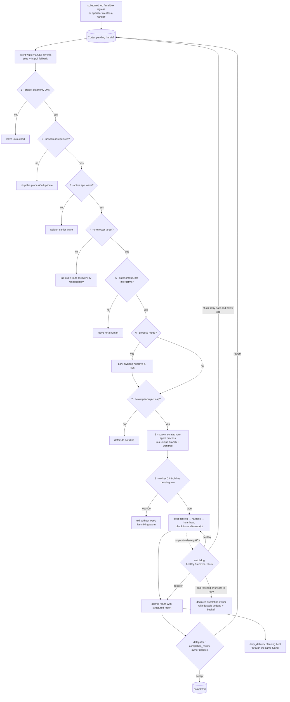

# Autonomy: dispatch, supervision, and handback

**What it answers:** *how does a pending handoff become isolated, supervised work without
turning an agent's self-report into orchestration truth?*

> **Extraction status:** the v0.1.0 extraction is in progress. This document records the
> production lineage being extracted; an operator surface named below is not a standalone
> v0.1.0 guarantee until it is present in the published payload and discovery document.

## What it is

Cortex autonomy is a deterministic dispatch and supervision plane around the durable
[handoff lifecycle](handoffs.md). The scheduler selects eligible work; a separate worker
process is the **sole claimer**; Postgres decides who won; the watchdog classifies liveness
from durable signals; and completion returns to the delegator for accept/rework. The atomic
handoff plus atomic handback is the autonomy primitive. The scheduler does not make the
claim atomic, and an agent saying “done” does not make the row complete.



The **nine gates** end at the worker claim. Daily-delivery planning and watchdog recovery
are feedback paths around the funnel, not extra gates. Event and poll overlap is harmless
within one scheduler because of its seen-set; across processes, only the worker's
`pending → claimed` compare-and-swap is durable. If two workers are spawned, one can win
and the other must exit without touching the task.

The worker unit is one process for one handoff:

```text
cortex-boot → durable claim → prepare completion-return outbox → run harness
→ write heartbeat/check-ins/transcript → return handoff → exit
```

A successful harness run whose return acknowledgement is uncertain is held as
`return_pending`/quarantined and retried at the return boundary. It is not automatically
re-executed as if no work happened.

## Why it exists (the history)

- **Sole claimer, not orchestrator pre-claim.** Pre-claiming made the spawned worker's own
  claim fail, so it exited without doing the work. The console now pre-creates run state
  but does not claim; the worker owns both claim and return. The plain Postgres CAS was
  already atomic, so the model-budget reserve/block path was removed (`6762a392`, −238
  lines). `/claim-with-budget` is telemetry only.
- **Spawn, do not host.** Each handoff runs in its own OS process and the scheduler awaits
  exit off-loop. That design removed the v1 dispatch stall caused by hosting a harness
  stream inline while synchronous reads blocked the event loop.
- **Handback, not silent completion.** Since `fd060c84` (2026-07-26), completion returns a
  report to the delegator; approval policy runs before terminal completion and occupancy
  follows explicit handbacks. `evidence_quality` says structured, scraped, or inferred —
  never “verified”.
- **Bounded watchdog action.** A successful run stranded as claimed is returned through the
  normal review gate. A provably stale, retry-safe run is released to pending while
  `retry_count < WATCHDOG_MAX_RETRIES` (default 3); at the cap it is escalated. Unknown
  liveness is not proof of failure, and the watchdog never kills a run.
- **The 2026-08-20 signal storm.** A provider-quota outage killed 23 harness spawns.
  Closing all 23 watchdog signals at 19:17:26Z produced **19 fresh signals for the same
  targets by 19:17:46Z — 20 seconds later**, spending the same exhausted provider capacity
  to report the outage. Signal history now covers every status; the re-notification window
  starts at one hour, doubles per prior signal, and caps at 24 hours. If history is
  unavailable, supervision falls back to open-signal dedupe and reports
  `signal_history_unavailable`; damping may degrade, but it never silences rescue.
- **Responsibility routing replaced role folklore.** Six responsibilities —
  `completion_review`, `escalation`, `daily_delivery`, `deliverable_owner`,
  `human_escalation`, and `runtime_administration` — must each resolve to exactly one
  roster row. Hard-coded `lead`/`pm` names had made portable projects unroutable.
- **Backfill repaired a silent upgrade failure.** Only onboarding initially wrote those
  declarations, so pre-existing projects upgraded to v0.2.001 with none and stopped
  producing handbacks, escalations, and recovery work. Startup backfill writes all six
  only onto one unambiguous lead, is idempotent, never overwrites operator assignments,
  and refuses to guess. Unhealed projects are an ERROR in `/cortex/health`, not green.
- **Isolation protects both workers and the authority checkout.** Harnesses had modified
  the registered `repo_root`, then blocked every later worker at the clean-source gate.
  Autonomous runs now receive a unique branch/worktree. Clean no-op worktrees can be
  reclaimed; edits or commits are retained as integration evidence.
- **Propose mode is a real queue.** It was hardened after an `awaiting` status mismatch
  parked work in a row the listing query could never find. Propose mode now holds the
  handoff until an explicit approval; a database read failure gates rather than spawns.

## How to use it

The lineage operator flow is:

```bash
# 1. Inspect the project flags and keep training wheels on initially.
curl http://127.0.0.1:8765/settings/my-project/flags

# 2. Create work through the normal durable lifecycle.
cortex-handoff --create --confirm --from lead --from-role lead \
  --to worker --to-agent worker --priority high \
  --summary "Implement the accepted handoff" \
  --acceptance '{"gate":"observable completion condition"}'

# 3. Inspect ground truth rather than an agent's narration.
cortex-handoff --show <handoff-id>
```

In the integrated console, `POST /settings/{project}/flags` sets `autonomous` and
`propose_mode`; use `autonomous=true, propose_mode=true` first, then turn propose mode off
only after approval runs prove the roster and workspace. Scheduled jobs and mailbox
feeders create ordinary handoffs — they do not bypass the funnel or run agents directly.
The feeder contract uses per-feeder, header-only tokens with constant-time comparison,
a public-path allow-list, suppression enforcement, durable occurrences, and explicit
overlap policy. A feeder receipt proves emission, not successful execution.

## What to set up

1. Register the project with the correct Git `repo_root`; keep tracked and untracked source
   clean before autonomous dispatch.
2. Configure each intended worker as **autonomous**, with a real harness route and provider
   readiness. Interactive and deterministic agents are deliberately not normal auto-run
   targets.
3. Declare exactly one owner for each of the six routing responsibilities. Only the single
   `runtime_administration` owner receives full harness access. Check the responsibility
   posture in `/cortex/health` rather than assuming startup backfill succeeded.
4. Keep worktree isolation enabled (`KAIDERA_AGENT_WORKTREE_ISOLATION=1`). If mutable
   runtime state must cross worktrees, commit directory roots to `.kaidera/state-paths`;
   absolute paths, traversal, globs, `.git`, `.worktrees`, `.kaidera`, individual files,
   and symlinks are not valid escape hatches.
5. Run the autonomy engine and watchdog. Defaults evidenced in the lineage are a per-project
   concurrency cap of 3, ~4-second poll fallback, 60-second watchdog sweep, 15-minute stale
   threshold, and three automatic requeues before escalation; treat environment overrides
   as operational policy, not universal constants.
6. Start with propose mode on. Turn autonomous dispatch on only after checking the Dispatch
   feed's skip reasons, then disable propose mode for unattended spawning.
7. Configure scheduled jobs/mailbox ingress with their own credentials and overlap/suppression
   policy. The canonical daily-delivery planner is a scheduled handoff through this same
   funnel; the old direct PM-beat script hook is compatibility-only and should remain empty
   to avoid double planning.

For machine installation status, see the [deployment process](../guides/deployment-process.md):
the public v0.1.0 payload is still the extraction gate.

## Limits (honest)

- This is deterministic **coordination**, not a guarantee that an agent's work is correct.
  Acceptance, evidence, review, and verification remain separate contracts.
- CAS gives one claim winner; it does not guarantee only one process was spawned. A losing
  409 is a sibling alarm, not a retry instruction.
- The in-process seen-set is not a distributed lock and disappears on restart. Durable
  safety comes from the database claim and handback transitions.
- The watchdog acts only on observable durable state. Missing/unknown observations cause
  quarantine or degraded supervision, not an invented “healthy” or “failed” answer.
- Automatic requeue is permitted only when the execution side-effect boundary is known
  retry-safe. Uncertain or committed work is quarantined to avoid duplicate side effects.
- Responsibility routing deliberately stops on zero or multiple owners. Backfill cannot
  heal an ambiguous roster and never overwrites a partial operator configuration.
- Worktrees isolate filesystem indexes; they do not merge, review, or deploy changes. Edited
  worktrees are retained for a human/integration process.
- Propose mode, mailbox ingress, the console scheduler, and its Settings routes are lineage
  surfaces while the standalone v0.1.0 extraction remains in progress. Check discovery and
  the published payload before scripting against them.

## Sources

- Census anchors: `FUNCTIONALITY_CENSUS.md` rows **27–54**, **165–173**, and
  **286–299**, plus workspace isolation row **345**.
- Dispatch and worker: `local-cortex/console/app/orchestrator.py` (`_maybe_dispatch`,
  `ORCH_MAX_CONCURRENT`, event/poll paths) and `run_agent.py` (sole claim, heartbeat,
  completion-return outbox and atomic return).
- Watchdog: `local-cortex/console/app/watchdog.py` (`classify_run`, bounded requeue,
  `WATCHDOG_SIGNAL_BACKOFF_SECONDS`, `_signals_in_backoff`); incident 2026-08-20.
- Routing: `app/domain/roles.py`, `responsibility_backfill.py`, and
  `responsibility_health.py`; v0.2.001/v0.2.002 regression record.
- Isolation: `app/worktree_isolation.py` (`prepare_worker_workspace`, committed
  `.kaidera/state-paths`, `cleanup_if_unchanged`); genesis `6a65d4cb`, loop wiring
  `10f3af66`.
- Operator contract: `local-cortex/console/docs/AUTONOMY_GUIDE.md` (2026-08-18) and
  `SETTINGS_AND_FLAGS.md` §5.
