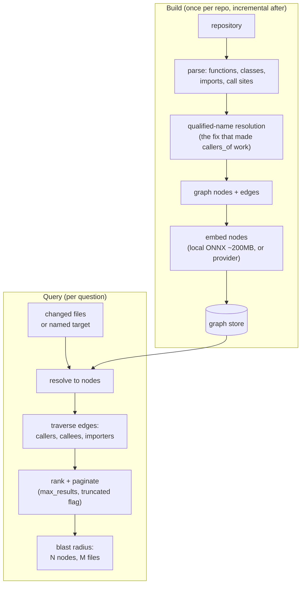

# Code graph & blast radius

**What it answers:** *"If I change this, what breaks?"* — before you change it.

## What it is

Cortex builds a **code graph** of a repository — functions, classes, imports, call edges,
embedded for semantic lookup — and answers impact questions against it:

| Command | Question |
|---|---|
| `cortex-graph-build` | (re)build the graph for a repo |
| `cortex-graph-blast` | blast radius: all nodes impacted by a change |
| `cortex-graph-callers` | who calls this function |
| `cortex-graph-impact` | impact of a changed-file set |
| `cortex-graph-search` | semantic search over code nodes |
| `cortex-graph-large-fn` | oversized-function hotspots |
| `cortex-graph-stats` / `cortex-graph-prune` | graph health / retire stale nodes |

## Why it exists (the history)

Adopted 2026-04-07 during a launch sprint, as a fork of `better-code-review-graph`
(n24q02m) — chosen over the upstream project because upstream's `callers_of`/`callees_of`
**returned empty results** due to a bare-name target-resolution bug; the fork resolves
qualified names with a bare fallback, and it was verified same-day on a real codebase
(`callers_of('_dispatch_builtin_tool')` → 2 actual callers, including a teammate's
in-flight test). Also decisive: a 200 MB ONNX embedding footprint instead of 1.1 GB of
torch, and paginated outputs instead of unbounded 500K-character responses.

It earned absorption into Cortex within weeks. The recorded testimonial (2026-05-03): a
pre-migration probe — `cortex-graph-blast --target schema` returned **0 impacted nodes**,
which was itself the answer: the migration's risk was in database constraints, not code
dependencies, so review effort went where the risk actually was. A blast radius of zero,
trusted, is as valuable as a large one.

## How it works



Traversal is transitive over call/import edges from the resolved targets; results are
paginated with an explicit `truncated` flag — you always know whether you saw everything.

## How to use it

```bash
cortex-graph-build --repo .                      # first: build (thousands of nodes, minutes)
cortex-graph-blast --repo . --target my_function --max-results 20
cortex-graph-callers --repo . --target _dispatch_builtin_tool
cortex-graph-stats --repo .                      # node/edge counts, staleness
```

Read the output honestly: `0 nodes impacted` for a name that *should* exist means your
target didn't resolve — check spelling/qualification before concluding "safe".

## What to set up

- The graph store rides the standard Cortex deployment — nothing extra.
- Embeddings: the local ONNX backend works offline out of the box; or point at your
  configured embedding provider ([models.md](../models.md)) for consistency with memory
  search.
- Rebuild cadence: after significant merges, or wire `cortex-graph-build` into the
  orchestrator's scheduled jobs; `cortex-graph-prune` retires nodes for deleted code.

## Limits (honest)

- Static analysis: dynamic dispatch, reflection and string-built imports are invisible.
  Blast radius is a **floor**, not a ceiling.
- A stale graph lies. `cortex-graph-stats` shows build age — check it before trusting a
  radius on a hot repo.
- Cross-repo edges are not modelled; radius stops at the repository boundary.

## Sources

Adoption decision + fork rationale (2026-04-07, recorded reference); verified production
run and testimonial (`CODE_GRAPH_BLAST_RADIUS_TESTIMONIAL_2026-05-03`); current surface:
9 `cortex-graph-*` commands, `/cortex-graph/*` API routes.
