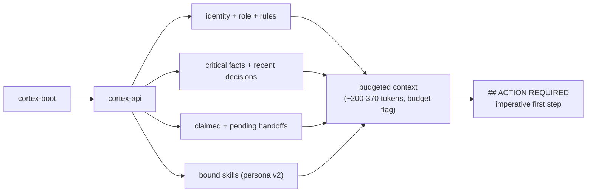

# Boot: who am I, what is in flight, what do I do first

**What it answers:** *an agent starts with an empty context window — how does it become a
team member in one call?*

## How it works



Boot is **budgeted** (`--budget`, default 1200 tokens), **project-scoped** (no cross-project
bleed — a real incident forced that), and **provenance-stamped**: the payload states which
table and hash each element came from, so a stale persona is attributable, not mysterious.

## Why it exists (the history)

- **27× token cut:** session-start context once meant loading whole files (~8-10k tokens).
  Tiered boot compresses the same orientation into a few hundred.
- **The imperative block:** an entire fleet once claimed work and then idled — RCA found
  boot output was purely *descriptive* ("Next loop in 56m") with no instruction. Boot now
  ends with `## ACTION REQUIRED`: the top claimed handoff, the first step, and the log
  template. Claim is start-of-work; boot says so.
- **The pollution incident (2026-04-17):** an unscoped boot leaked another deployment's
  infrastructure as truth and triggered a 3,000-line wrong-direction rewrite. Boot output
  is scope-tagged since; project isolation is checked, not assumed.
- **PersonaPayload v2:** a typed, versioned contract (`cortex.persona.v2`) emitted
  alongside legacy fields — additive, byte-identical regression-proven — carrying skills
  and rules from the registry, so the same agent boots identically from Claude Code,
  Codex, Gemini, or any MCP harness. Model-independence is a design rule, not a hope.

## How to use it

```bash
export CORTEX_PROJECT=my-project
cortex-boot alice                 # the canonical session start
cortex-boot alice --budget 250    # tighter, for small contexts
cortex-onboard alice              # first-time onboarding + diagnostics
```

Generated harness files ([discovery](../discovery.md)) mean an agent opening the project
directory already knows to run this.

## Limits (honest)

- Boot reflects the registry *now*; an agent holding yesterday's boot holds yesterday's
  roster. Long sessions re-boot at natural boundaries.
- The budget trims by tier — under a tiny budget, recent-history detail goes first.
- Boot is orientation, not authority: the handoff queue and `--show` are ground truth.

## Sources

MemPalace L0-L2 stacking (2026-04-07, 27× measurement); ACTION-REQUIRED block (2026-05-21,
claim-then-idle RCA, handoff `ffd668e8`); scope-tagged boot after the 2026-04-17 pollution
incident; PersonaPayload v2 `28584846` + provenance `2a7516ad` (2026-06).
