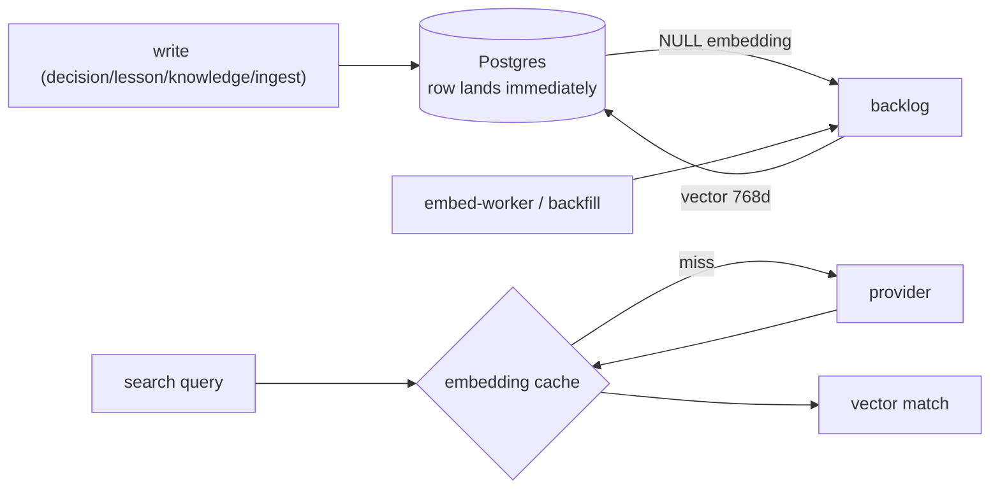

# Embeddings: enrichment that never blocks a write

**What it answers:** *how does everything become searchable — and what happens when the
embedding provider is down, slow, or misconfigured?*

## How it works



**Degraded mode is a feature:** a provider outage means rows persist with NULL embeddings
and a backfill catches up later — logging is never blocked on enrichment. The corollary is
the real operational rule: **a NULL-embedding backlog, not text size, is the retrieval
bottleneck.** Coverage is the number to watch.

## The history worth knowing (all of it paid for)

- **Three stacked backfill defects, found in one week (2026-08-18):** a single JSONB
  *scalar* metadata row aborted an entire batch and silently blocked 225,108 rows
  (`COALESCE` rescues SQL NULL, not a double-encoded `"{}"`); the job ledger ran DDL on
  the app pool and died on `permission denied` — killing every async embed and graph
  build; and `WHERE id::text = $n` defeated the primary key (112.8ms → 0.057ms per row
  once fixed). Net: 1130ms → 263ms per row. **`--dry-run` proves nothing** — it returns
  before the UPDATE.
- **The credential-plane split:** operators added a provider key in Settings, watched
  "Test" succeed — and every embedding still failed, because the API read a *different*
  credential store. 88.6% of one deployment's decisions sat unembedded *with a key
  configured*. One canonical store now, and the doctor warms the cache before judging.
- **Index weight, not text weight:** the store once "weighed" 7.3 GB — most of it a
  degenerate `ivfflat lists=1` index fleet with zero lifetime scans. HNSW replacements plus
  opt-in `halfvec` casts took it to 4.6 GB (−36%) at **35/35 top-5 recall, zero loss** —
  gated by a deterministic recall check before any lossy change may ship
  (`recall ≥95% AND commitment_loss == 0`).
- **Keyless local search (2026-08-21):** the embed-worker ships pinned local models, so an
  appliance can embed and search with **no provider key at all**.

## How to use it

```bash
cortex-embed --table all --stats     # coverage: the number that matters
cortex-embed --table messages        # chunked backfill with error thresholds
# async: POST /beat/embeddings/backfill -> poll GET /beat/embeddings/jobs/{id}
```

## What to set up

A provider from the ladder ([models](../models.md)) — or nothing, with the local-embed
profile. Verify the *effect* after configuring: coverage rising and search answering, not
"Test succeeded".

## Limits (honest)

- Messages are ~99.7% unembedded **by policy** (volume vs value); search still reaches
  them through BM25/trigram.
- Backfills are rate-bound by the provider tier; free tiers are fine for memory, felt on
  large corpora.
- The recall gate protects lossy *transforms*; it does not measure your provider's model
  quality — A/B that yourself when switching.

## Sources

Backfill defects `9f0ef1a3`/`8638b243`/`ad25c594` (2026-08-18); credential unification
`4694b917`; index program `58144abf`/`9ffcf383` (−31% then −36%, 2026-06-21); recall gate
`c20b26c2`; keyless local `e9749b9a` (2026-08-21).
