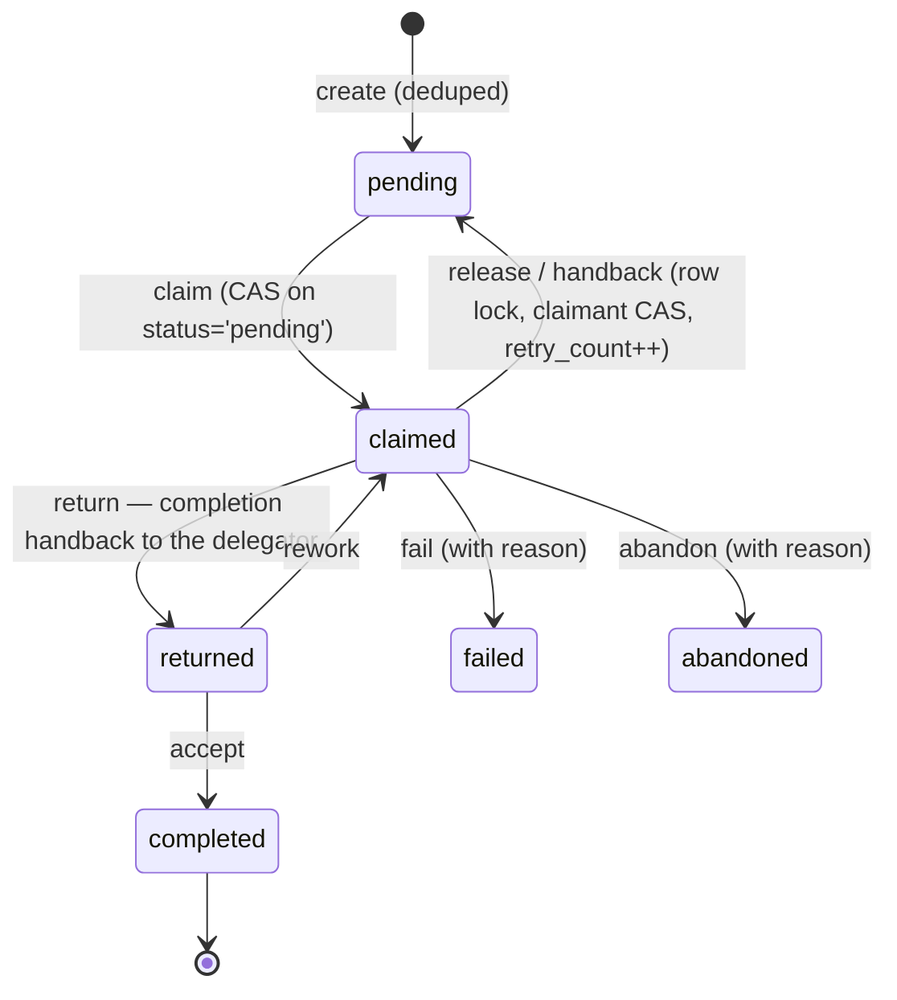

# Handoffs: atomic claim, informative failure, handback

**What it answers:** *how does work move between agents with no human relaying it — and
without two agents ever doing the same work?*

## What it is

A handoff is a durable unit of work with a database-enforced lifecycle. Not a message, not
a convention: every transition is a compare-and-swap against Postgres, which is why a fleet
of autonomous workers can share one queue without a coordinator process.



## Why it exists (the history)

Every mechanism above was forced by a production failure:

- **Atomic claim** — one conditional `UPDATE … WHERE status='pending' AND <recipient
  guard>`; Postgres MVCC guarantees a single winner. An earlier orchestrator *pre-claimed*
  for its worker: the worker's own claim then 404'd and it exited without doing the work —
  the double-claim bug. The fix made the spawned worker the **sole claimer**, and the
  budget-gated claim path was deleted outright once the plain claim proved atomic
  (−238 lines).
- **Informative failure** (2026-06-05) — a lost claim used to be a bare 404. Three SQL
  predicates for "who may see / who holds" had drifted apart, so an agent's *own claimed
  row vanished from its own queue* — visible but unclaimable, with idle-on-claim as the
  symptom. Now one canonical recipient/claimer SQL and a re-derived answer: **409 naming
  the current claimer** ("claimed by ren@kaidera-os"), 409 "changed state during claim
  (race)", or **403 naming the role mismatch**. A 409 is a *live-sibling alarm*, not a
  retry hint.
- **Create-dedupe** — a PM agent once filed the same handoff twice within seconds. Create
  now fingerprints the request, takes `pg_advisory_xact_lock` on the fingerprint, and
  returns the existing open row with `{deduped: true}`.
- **Atomic completion handback** (2026-07-26) — completion is not a silent close. The work
  **returns to its delegator** with an explicit accept/rework decision, and approval policy
  evaluates *before* terminal completion. The scheduler derives occupancy from these
  explicit handbacks, never from inferred state.
- **Evidence classes** — a completion report is labelled by how it was obtained:
  structured block, scraped from loose text, or inferred from a legacy marker. The field is
  deliberately *not* called "verified", because nothing verifies it.

## How to use it

```bash
cortex-handoff --create --confirm --from kai --from-role lead --to cpo --to-agent ren \
    --priority high --summary "Review the boundary" \
    --acceptance '{"gate":"what done means"}'      # written at creation, judged at return
cortex-handoff --mine ren          # status-aware: eligible + claim_hint per row
cortex-handoff --claim <id>        # claim BEFORE touching anything
cortex-handoff --return <id>       # handback with the completion report
cortex-handoff --release <id> --reason "blocked on X"   # requeue, retry_count++
cortex-handoff --show <id>         # ground truth of last resort
```

Cross-project handoffs exist but are deliberately hard: `--target-project` plus a recorded
`--cto-override <decision-id>`. Isolation is the default; the exception leaves a receipt.

## What to set up

Nothing beyond a running Cortex: the lifecycle is schema + API. For autonomy on top
(dispatch → spawn → sole-claimer worker → watchdog → handback routing), see the
[deployment process](../guides/deployment-process.md) and the autonomy functionality doc.

## Limits (honest)

- The claim guard keys on recipient **role/agent**, and `--to <role>` vs `--mine <agent>`
  are asymmetric by design — querying `--mine some-role` returns nothing and has misled
  operators into reporting a busy agent idle.
- Priorities are a fixed enum (`low|medium|high|urgent`); an invalid value is a loud 400,
  learned after `'normal'` produced a bare 500.
- Acceptance/evidence are JSON contracts, not prose — a completion judged against
  goalposts written at creation is the point.

## Sources

Claim CAS + MVCC review (2026-06-19 ultracode report, Addendum A); claim-desync RCA and fix
`8addda87` (2026-06-05); budget-gate removal `6762a392`; dedupe `2be32cc1`; atomic handback
`fd060c84` + `21575682` (2026-07-26); handback-driven occupancy (v0.2.001); evidence classes
`201d9292` — "three writers since June and ZERO readers … the system knew and did not say".
