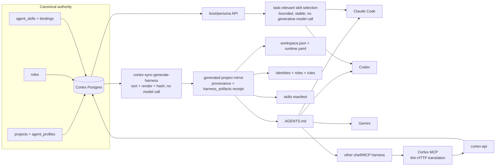

# Harness integration: one Cortex, many runtimes

**What it answers:** *how can Claude Code, Codex, Gemini, Cursor or another harness start
the same agent without making any harness-specific file the source of truth?*

> **Extraction status:** the Cortex OSS v0.1.0 extraction is in progress. This page records
> the shipped lineage and the boundary the extracted product must preserve; command and MCP
> packaging may still move before the v0.1.0 release.

## What it is

Cortex is the canonical store for project identity, roles, rules and skills. The harness
integration projects that state into a deterministic, per-project `.agents/` mirror. The
mirror is a cache for runtimes which need files at session start, not another authoring
surface.

The boundary is deliberately **pure-runtime and model-independent**:

- generation is a deterministic data-to-files operation; it never asks a model to interpret
  or rewrite the state;
- `AGENTS.md` is the neutral pointer, while `CLAUDE.md` and `GEMINI.md` are thin symlinks to
  it rather than separate instruction sets;
- persona, rules, skill bindings and steering remain in Cortex, so one model's private
  memory or startup hook cannot become authoritative;
- a harness may keep its own automatic memory as a cache, but Cortex wins on conflict;
- MCP is a translation layer over the same Cortex HTTP API, not a second implementation.

Model independence does **not** mean every Cortex feature is model-free. It means the
harness compiler and canonical agent contract do not depend on a particular model,
provider or proprietary session hook.



## Why it exists (the history)

- **One authority instead of linked copies.** The 2026-06-04/05 keystone cutover followed
  real cross-project drift: EnGenAI booted from EnGen OS's `cortex.md`, a supposedly central
  `workspace.json` proved false, and identity routing confused `kai`, `atlas` and
  `cortex-architect` with `root`. The response was structural: generate local mirrors from
  Cortex, never maintain peer copies.
- **Safe, attributable generation.** Commit `a9b7d912` made the reverse of workspace sync
  deterministic and idempotent. Every Markdown file carries `GENERATED FROM CORTEX — DO
  NOT EDIT (source: <table>@<hash>)`; JSON carries equivalent `_generated` metadata. An
  applied file also has a `harness_artifacts` content-hash receipt, so a later hand edit is
  detected rather than silently overwritten.
- **A cutover that can be undone.** `04bc4545` added preflight, backup, apply, identity
  verification and rollback; `dbb5d5f0` added coherent orphan removal. This was built so
  moving from disk-authored `.agents/` state to Cortex authority was testable rather than a
  flag day with no way back.
- **Shared skills without prompt bloat.** `3de79025` created one installable skill registry
  shared by workers. `34cdb04f` then selected a bounded, task-relevant set instead of
  injecting an entire large library into every prompt. The selection hot path does not use
  a generative model and has stable ordering.
- **No Claude-only escape hatch.** During the 2026-05-05 bootstrap-friction RCA, a proposed
  Claude `SessionStart` hook was rejected. The binding rule is that Claude Code, Codex,
  Gemini, Cursor and OpenClaw/Hermes must be able to boot the same agent from the same
  canonical state.
- **One protocol surface for other harnesses.** The MCP design chose Option A: every tool
  call becomes an HTTP request to `cortex-api`. Fixes to project scoping or lifecycle
  semantics therefore stay in the API rather than being reimplemented per client.

## What gets generated

For a project key, the deterministic tree contains:

| Path | Purpose |
|---|---|
| `AGENTS.md` | Neutral pointer: boot through Cortex and do not edit generated files |
| `CLAUDE.md`, `GEMINI.md` | Relative symlinks to `AGENTS.md` |
| `.agents/config/workspace.json` | This project only, including its canonical root and default agent |
| `.agents/config/runtime.yaml` | Pointer to the shared post-Redis Cortex runtime |
| `.agents/agents/*_IDENTITY.md` | Identity profiles read from `agent_profiles` |
| `.agents/roles/*.md` | Role profiles read from `agent_profiles` |
| `.agents/rules/<project>.md` | Active project rules |
| `.agents/skills/manifest.json` | Visible skills and their agent/role bindings; empty-safe |
| `.agents/scripts` | For non-canonical projects, a symlink to the canonical command tree |

Given the same Cortex rows, generation sorts and serialises to byte-identical output.
`--diff` and `--out` do not write the live tree. `--apply` first backs up every path it may
replace or remove, checks prior receipts for hand edits, writes the mirror, records new
receipts, then removes backed-up superseded layout files.

## How to use it

Preview first; `--diff` is the default:

```bash
cortex-sync-generate-harness my-project --diff --live-root /path/to/my-project
cortex-sync-generate-harness my-project --out /tmp/my-project-harness
```

Prepare the additive schema once, then rehearse and perform a project cutover:

```bash
cortex-harness-cutover foundation
cortex-harness-cutover my-project --dry-run
cortex-harness-cutover my-project
```

The project cutover checks broken rule links and the configured repository root, seeds the
current disk rules/profiles back into Cortex, generates and applies the mirror, then checks
that the generated default-agent identity refers to that agent. Use `--force` only after
reviewing a preflight failure or a reported hand edit; it is an explicit overwrite.

Inspect one or several mirrors:

```bash
cortex-harness-doctor --root /path/to/my-project --expect-project my-project
cortex-harness-doctor --workspace-config /path/to/.agents/config/workspace.json --json
```

The doctor exits non-zero for drift unless `--advisory` is chosen. It detects mismatched
project keys, retired Redis-era runtime configuration, broken or manual harness pointers,
and copied project-local command trees.

Restore the most recent backup, or a named UTC backup:

```bash
cortex-harness-rollback my-project
cortex-harness-rollback my-project 20260605T120000Z
```

Manage shared skills through Cortex rather than editing the generated manifest:

```bash
cortex-skill install ./skills/web-reader --scope global
cortex-skill install ./skills/release-check --scope project --project my-project
cortex-skill bind release-check --to reviewer --kind role --project my-project
cortex-skill bind release-check --to kai --kind agent --project my-project
cortex-skill list
```

A global skill is stored under the sentinel project `*` and reaches every agent without a
binding. Project and agent scoped skills require a binding. At dispatch, the current
lineage selects at most the configured task-relevant set (`KAIDERA_MAX_SKILLS`, default 3)
and injects the selected `SKILL.md` bodies; a skill supplies guidance and scripts, not extra
tool permissions.

### MCP-speaking harnesses

The invocation below is a **Kaidera OS source-tree example only**:
`.agents/api/mcp_server.py` is not generated into a project mirror, and no standalone MCP
entry point is published yet. The source implementation requires the MCP SDK and `httpx`,
plus an explicit project. In its default `stdio` mode the parent harness is the trust
boundary:

```bash
CORTEX_PROJECT=my-project \
CORTEX_AGENT=kai \
CORTEX_API_URL=http://localhost:8501 \
python .agents/api/mcp_server.py
```

For shared `streamable-http`, configure `CORTEX_MCP_TRANSPORT=streamable-http`, bind host
and port with `CORTEX_MCP_HOST`/`CORTEX_MCP_PORT`, and set
`CORTEX_MCP_BEARER_TOKEN`; an empty token disables transport authentication and is only a
development convenience. API authentication to Cortex itself remains separately available
through `CORTEX_API_BEARER_TOKEN`. The MCP process requires `CORTEX_PROJECT` and refuses
to guess it.

## What to set up

1. Run Cortex and register the project, its canonical repository root, default agent and
   roster.
2. Apply the skills/rules/harness-artifacts foundation migration before the first cutover.
3. Import the existing disk-authored profiles and rules during cutover; thereafter edit
   canonical Cortex state and regenerate.
4. Install skills into the shared skill store, register them, and bind non-global skills to
   an agent or role.
5. Expose the generated thin mirror to each harness. Do not add provider-specific canonical
   instructions beside it.
6. For MCP, configure the API URL, project, caller identity and appropriate transport
   authentication in the harness process environment.

## Limits (honest)

- Cortex OSS **v0.1.0 extraction is still in progress**. The lineage is authoritative for
  behaviour, but final packaging, command locations and the published MCP catalogue are
  still being reconciled.
- The hand-edit guard compares disk content with a prior `harness_artifacts` receipt. A
  first apply has no prior receipt; review its diff and rely on the timestamped backup.
- Rollback restores paths present in the backup, including symlinks, but the shipped script
  does not remove files which did not exist before `--apply`; inspect newly created paths
  after a rollback.
- The doctor recognises known structural drift. It cannot prove that arbitrary prose is
  semantically correct.
- On-demand selection is bounded relevance routing, not a guarantee that every potentially
  useful skill is delivered. Keep mandatory operating rules in rules/persona, not in an
  optional skill.
- The MCP module is a thin API client, so API availability, authentication and project
  isolation still apply. Source inventory during extraction contains stale MCP status prose
  alongside a larger current registration set; do not treat an old tool count as a parity
  guarantee.
- Platform-lineage tenant MCP, tenant governance, provider-routing SaaS and PROMI service
  automation are outside this v0.1.0 extraction.

## Sources

Functionality census rows 115–119, 179, 225–226 and 569–573; generator
`a9b7d912`; safe cutover/rollback `04bc4545` and coherence/orphan cleanup `dbb5d5f0`;
harness drift doctor `a01a6a73`; shared skills `3de79025`; on-demand selection
`34cdb04f`; model-independence directive `feedback_cortex_model_independent.md`
(2026-05-05); current source surfaces `.agents/scripts/cortex-sync-generate-harness`,
`cortex-harness-{cutover,rollback,doctor}`, `cortex-skill`,
`local-cortex/console/app/run_agent.py::_select_skills`, and
`.agents/api/mcp_server.py`.
