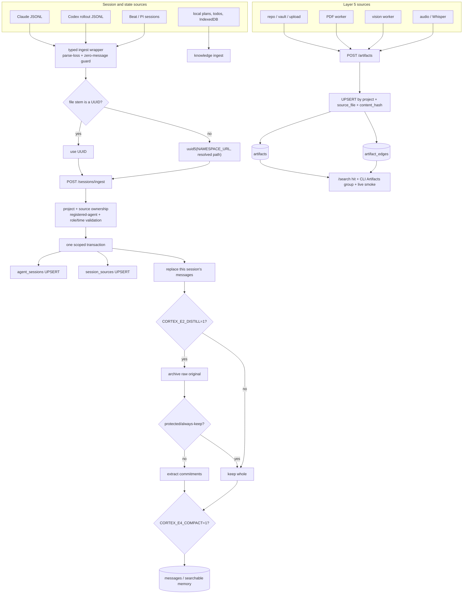

# Ingest: sessions, artifacts and multimodal memory

**What it answers:** *how does work produced outside Cortex become durable, searchable
project memory without silently losing messages, duplicating every sweep or hiding an
artifact behind a successful write?*

> **Extraction status:** the Cortex OSS v0.1.0 extraction is in progress. This page records
> the shipped lineage and its acceptance rules; final packaging and worker profiles may
> still change before the v0.1.0 release.

## What it is

Ingest is Cortex's project-scoped write boundary for:

- Claude, Codex and Beat/PI session transcripts;
- Claude local plans, todos and IndexedDB state;
- Markdown memory corpora and save-chat checkpoints;
- non-chat artifacts from a repository, vault, upload, API capture or transcript;
- PDF, image/diagram and audio-derived content through guarded workers;
- optional write-side memory transforms: E2 commitment distillation and E4 deterministic
  symbolic compaction.

Session ingest is idempotent and atomic. The CLI parses a source file, derives the same
canonical session identifier the server will store, and refuses parse loss, an empty real
message set or an unknown writer unless the caller explicitly chooses a narrow escape
hatch. The API validates scope and roles before opening one transaction, then upserts the
session/source records and replaces that session's messages as a unit.

Artifacts are Cortex Layer 5 (L5): content with a modality, source, extraction method,
content hash, raw text, bounded context and optional parent. `artifact_edges` relate the
artifact to a code target or another domain reference. A row is not the whole feature:
write, search, CLI presentation and a live retrieval smoke must ship together.



## Why it exists (the history)

- **Transcript history must survive harnesses.** The original 2026-06-02 ingest collected
  sessions into `messages` and `agent_sessions`; Beat ingest followed in `722f622f`. A
  harness transcript is evidence and memory, not disposable terminal output.
- **Idempotence must use the server's identity.** Before `15ac9a60` (2026-08-05), the batch
  sweep compared a Codex `rollout-*` basename with server UUIDs. The server actually used
  `uuid5(NAMESPACE_URL, resolved_path)`, so every sweep uploaded every Codex session again.
  Server-side upsert prevented extra rows, but each sweep wasted minutes and printed false
  “imported” activity. Client and server now derive the same identifier.
- **Bad parse is not an empty success.** The transcript wrappers reject malformed JSONL and
  zero real messages by default. The API also refuses to mint an agent from transcript
  inference: an unregistered name is a 403, not a phantom roster entry. This keeps a typo or
  parser regression from becoming durable history.
- **L5 must be observable end to end.** In the 2026-05-16 dogfood incident, raw artifact
  rows existed while operators saw blank search results and concluded ingestion had lost
  the data. The resulting acceptance rule is explicit: the write path, `/search` result,
  CLI `### Artifacts` grouping and live smoke move together.
- **Images, tables and equations are knowledge.** The L5 design followed the RAG-Anything
  result that treating these as entities rather than incidental metadata materially
  improved long-document retrieval. Parent/child records and typed edges preserve their
  cross-modal relationship to the source.
- **Storage savings cannot spend commitments.** `a805d10f` wired E2 distillation and E4
  compaction behind flags. `c20b26c2` replaced a placeholder benchmark with the hard gate:
  protected-token recall at least 95% **and zero commitment loss**.
- **The shadowed-function lesson.** In `dbf5e963` (2026-08-16), E4's storage
  `compact_text(text) -> (text, changed, savings)` had been shadowed by an unrelated later
  display helper named `compact_text(value, limit) -> str`. E4 was simultaneously dead and
  broken if enabled. The import is now deliberately aliased to `compact_for_storage`.
  Feature flags do not validate a dormant path; enable gates must execute the actual call
  chain and function names with incompatible contracts must stay distinct.

## Session identifiers and write guarantees

For `cortex-ingest-session`, `cortex-ingest-codex` and the batch sweep:

1. Resolve the source file path.
2. If its stem parses as a UUID, use that UUID.
3. Otherwise use `uuid5(NAMESPACE_URL, resolved_path)`.
4. Compare that canonical value with `GET /sessions/ingested-ids` before upload.
5. Send the same value to `POST /sessions/ingest`.

Inside the API, `source_path` cannot be reassigned across projects, and an existing session
UUID cannot be reused by another project. The named agent must already be registered.
Roles and ISO-8601 timestamps are validated before the transaction. Within the transaction
Cortex upserts `agent_sessions`, upserts `session_sources`, deletes the old messages for
that project/session, bulk-inserts the current file's messages, and marks the session
`ingested`. A failed transaction does not leave a half-replaced transcript.

The path-derived UUID is intentionally path-sensitive: moving a non-UUID transcript changes
its identifier. Preserve source paths for stable repeat sweeps, or retain an explicit UUID
filename when relocating an archive under controlled conditions.

## How to use it

Ingest one Claude or Codex JSONL file with an explicit registered writer and project:

```bash
cortex-ingest-session ~/.claude/projects/example/session-id.jsonl kai my-project
cortex-ingest-codex ~/.codex/sessions/rollout-2026-08-05.jsonl kai my-project
```

Both commands fail on any invalid JSONL line and on zero parsed messages. The only escape
hatches are explicit and should leave an operator decision in the surrounding work record:

```bash
cortex-ingest-session --allow-parse-loss transcript.jsonl kai my-project
cortex-ingest-codex --allow-placeholder empty.jsonl kai my-project
```

Sweep new harness sessions, with bounded work and a fail-loud error threshold:

```bash
cortex-ingest-all --limit 50 --sleep-seconds 1 --error-threshold 3 --max-errors 10
cortex-ingest-beat-sessions --root . --project my-project --agent kai --limit 50
```

`cortex-ingest-all --force` deliberately bypasses the already-ingested filter; it is for a
known re-ingest, not routine maintenance. Beat ingest includes PI and harness mirrors by
default and supports `--no-include-pi` or `--no-include-harness` for a targeted pass.

Preview then import Claude's non-chat local state:

```bash
cortex-ingest-claude-local-state --dry-run
cortex-ingest-claude-local-state
```

### Artifacts and edges

A basic repository artifact:

```bash
cortex-ingest-artifact docs/architecture.md kai my-project \
  --source-type repo_file
```

Store extracted text while retaining the original source, and relate the artifact to code:

```bash
cortex-ingest-artifact explain/service.html kai my-project \
  --source-type repo_file \
  --raw-content-file /tmp/service-explainer.txt \
  --section-context "Service boundary review" \
  --edge-type explains --target-type code --target-ref src/service.py
```

`--edge-type`, `--target-type` and `--target-ref` are an all-or-nothing tuple. The API
requires a SHA-256 content hash and upserts on `(project, source_file, content_hash)`;
repeating the same artifact updates its enrichment metadata without creating a duplicate
edge. Use `--parent-artifact-id` for derived chunks or child media.

Audio can use an existing transcript or invoke the available Whisper implementation:

```bash
cortex-ingest-audio interview.wav kai my-project \
  --transcript-file interview.txt \
  --source-type transcript \
  --section-context "Architecture interview"
```

The wrapper tries `whisper` and falls back to `whisper-cli` with a supplied GGML model. It
stores the audio as the source artifact and the transcript as raw content.

After any L5 write, acceptance is not “the command returned 0”. Confirm the artifact is
found through `/search`, appears in the CLI's Artifacts group, and survives a live query
from the intended project and harness.

## E2 distillation and E4 compaction

These transforms are opt-in and belong on the write path only after the recall gate passes:

| Transform | Behaviour | Recall protection |
|---|---|---|
| E2 `CORTEX_E2_DISTILL=1` | Archives the raw original, then extracts commitment/fact sentences into the hot tier | Keeps whole messages containing paths, verification/test terms, role routing, code blocks or JSON-like tool output |
| E4 `CORTEX_E4_COMPACT=1` | Deterministically removes low-value filler, whitespace and list scaffolding when savings exceed both 24 characters and 5% | Protects paths, UUIDs, quoted/code spans, test terms, numbers, proper nouns and structural tokens; otherwise returns the original unchanged |

When both are on, E2 runs first and E4 compacts each extracted commitment. Always-keep
messages remain whole, although E4 may compact their redundant surface form. The raw
original is archived before E2 replacement. The deterministic gate's release condition is
`recall >= 95% && commitment_loss == 0`, reported as `RECALL_PASSED`; anything else is a
failed enablement gate, not a warning.

## What to set up

1. Run Cortex, register the project and register the ingest writer. Session ingest will not
   infer or create an agent.
2. Configure `CORTEX_PROJECT` and a registered `CORTEX_AGENT`/project default for batch
   ingestion; the per-file commands may receive writer and project explicitly.
3. Keep transcript source paths stable and readable by the process running the CLI.
4. For artifacts, expose the source file and any extracted raw-content file to the CLI, and
   choose project-meaningful edge types and targets.
5. Select multimodal workers through the guarded managed-runtime profile. The shipped
   topology has PDF processing in the core worker set and adds audio/vision in the `full`
   profile; full activation is capacity-gated and runtime control is unavailable outside
   the native managed boundary. Worker capabilities are signalled in boot rather than
   guessed by callers.
6. Configure ingest/embed model choices centrally through `PATCH /admin/cortex/config`;
   do not put model literals in individual callers.
7. Leave E2/E4 off until the shipped recall benchmark passes against the deployment's
   representative corpus with zero commitment loss.

## Limits (honest)

- Cortex OSS **v0.1.0 extraction is still in progress**. The session and artifact contracts
  are census-backed; final worker images, profiles and command packaging remain part of the
  extraction.
- E2 and E4 are flag-gated and held off in the measured lineage. E2's current commitment
  extraction is deliberately simple, symbolic sentence matching, not a semantic guarantee.
  The recall gate, raw archive and always-keep floor are mandatory before activation.
- `--allow-parse-loss` and `--allow-placeholder` weaken the default guarantee. They exist
  for an intentional recovery case, not to make a broken parser green.
- UUID5 deduplication is stable for a stable resolved path. A moved non-UUID file receives a
  different identifier.
- An artifact row is not proof of retrieval. L5 is accepted only when write, API search,
  CLI grouping and live smoke all work.
- The measured API has no general `GET /artifacts/{id}` full-artifact route, and artifact
  search returns a bounded preview rather than the full raw payload. Search is relevance
  retrieval, not a prefix-enumeration API; galleries need their own run-state index.
- PDF, vision and audio worker loss degrades enrichment. It must not prevent core L1 writes
  or search over content already stored and embedded.
- Audio transcription requires an available `whisper` command or `whisper-cli` plus a
  model file. Vision escalation is selective, not a pass over every artifact.
- Platform-lineage FileVault bridges, tenant provenance bundles, Milvus L2, tenant
  governance and SaaS ingestion controls are outside the v0.1.0 extraction.

## Sources

Functionality census rows 126–128, 184–186, 219, 258 and 272–275; session UUID5 fix
`15ac9a60`; Beat session ingest `722f622f`; E2/E4 integration `a805d10f`; recall gate
`c20b26c2`; shadowed-function repair `dbf5e963`; multimodal runtime control `50e70948` and
capability signal `4bc327c4`; central ingest settings `92f75561`; Explain/L5 commits
`45965b72`, `665c8a2b`, `bc6c92e8` and `fe3b50b2`; current source surfaces
`.agents/scripts/cortex-ingest-{session,codex,all,beat-sessions,claude-local-state,artifact,audio}`,
`.agents/api/main.py::ingest_session`, `.agents/api/main.py::ingest_artifact`, and
`.agents/api/ingest/{chat_distill,symbolic_compact,recall_gate}.py`.
