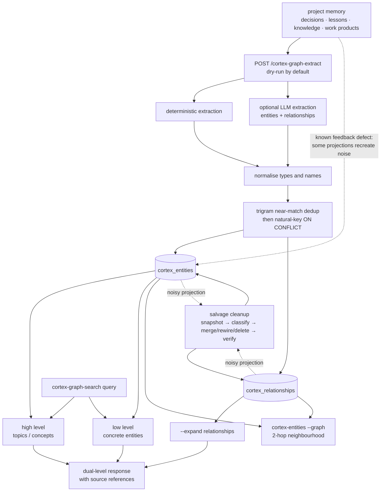

# Knowledge graph: entities, relationships and dual-level retrieval

**What it answers:** *which people, services, files and concepts are connected — and what
surrounds the thing I just found?*

> **Extraction status:** the Cortex v0.1.0 open-source extraction is in progress. This
> reference describes the evidenced kaidera-os L4 lineage being extracted; commands and
> repair utilities may arrive at different points in that cutover. It does not claim the
> separate platform fork's tenant governance, Milvus L2, citation bundles or PROMI service.
> [G9]

## What it is

The knowledge graph is Cortex's **L4 project-memory graph**, distinct from the L3
Tree-sitter code graph documented in [blast radius](blast-radius.md). It projects durable
memory rows into:

- `cortex_entities`: a name, entity type, description and source references;
- `cortex_relationships`: typed, weighted edges between two entities, with keywords and a
  description.

The extracted types evidenced by the command/API census are agent, service, file, epic,
tool, table, concept, endpoint, branch, project, product and model. Low-level retrieval
finds concrete entities; high-level retrieval finds broader topics. The default query runs
both levels and returns them separately, and `--expand` adds relationships around useful
hits. [G1] [G3]

## How it works



### Extraction and deduplication

Extraction can target `project_memory`, all sources, or decisions, lessons, knowledge and
work products. The API surface is dry-run by default; mutation requires `--apply` and an
admin-gated request. The historical Phase A path used an LLM to produce entities and
relationships and pg_trgm fuzzy matching at similarity `> 0.7`; its recorded backfill
processed **356/356 decisions with zero duplicate natural keys**. [G2]

Database natural keys make repeat extraction idempotent at the final write boundary:

- entity: `UNIQUE (project, name, entity_type)`;
- relationship: `UNIQUE (project, source_entity_id, target_entity_id, relationship_type)`.

They let the extractor use one `ON CONFLICT` operation rather than the earlier
update-then-insert-where-not-exists sequence. Near-match handling and the exact natural key
solve different problems: the former coalesces spelling variants; the latter prevents a
repeat write of the same canonical node or edge. [G2]

### Retrieval and neighbourhoods

`cortex-graph-search` exposes LightRAG-style dual-level retrieval: `--high` restricts the
query to broad topics, `--low` to concrete entities, the default returns both, and
`--expand` includes connecting relationships. `cortex-entities --related` shows one-hop
incoming/outgoing edges; `--graph` traverses a two-hop neighbourhood. [G1] [G3]

## Why it exists (the history)

- **A graph can answer thematic questions with far less context.** LightRAG was chosen over
  Microsoft GraphRAG after a recorded comparison found **100 tokens and one call versus
  610,000 tokens and hundreds of calls — about 6,000× less**. [G1]
- **Natural keys removed a fragile write dance.** The Phase A.2 migration introduced the
  entity and relationship uniqueness contracts so extraction could use a single
  `ON CONFLICT` write after a duplicate pre-flight, rather than coordinating separate
  update and conditional-insert operations. [G2]
- **The retrieval rule was measured, not guessed.** The A/B harness took **20 real queries
  from 30 days of messages**. Graph search used **82.9% fewer output tokens**, was **79.0%
  faster**, and raised manual precision from **0.515 to 0.675**, but lost **4/20 exact
  strings**. The verdict was therefore “PARTIALLY VALIDATED”, not a blanket replacement
  for ordinary search. [G4]
- **Extraction needed repair after real pollution.** On the 2nd-brain graph, salvage
  cleanup reduced **680 entities / 1,042 relationships to 240 / 429** (**−64.7% / −58.8%**),
  removed **450 unique prohibited/noise entities**, and preserved **62 curated-wiki
  entities + 166 relationships**. [G6]

## How to use it

Start with a bounded dry-run. Apply only after checking the candidate rows and active
project. The raw local-worker path is retired; extraction goes through `cortex-api`. [G3]

```bash
# Inspect the extraction backlog without writing.
cortex-extract-entities --source project_memory --limit 20 --dry-run

# Apply a bounded extraction. Add --use-llm only when its provider is configured.
cortex-extract-entities --source decisions --limit 100 --apply --use-llm

# Dual-level retrieval: broad first, concrete second, then expand a useful hit.
cortex-graph-search "memory invalidation architecture" --high --limit 10
cortex-graph-search "cortex-invalidate" --low --limit 10
cortex-graph-search "memory invalidation architecture" --expand --limit 10

# Direct browsing and two-hop inspection.
cortex-entities --search "Cortex"
cortex-entities --related "Cortex"
cortex-entities --graph "Cortex"
cortex-entities --stats
```

The same extraction and retrieval surfaces are available over HTTP:

```bash
# Admin-gated, dry-run extraction.
curl --fail --silent --show-error \
  -X POST "${CORTEX_API_URL:-http://localhost:8501}/cortex-graph-extract" \
  -H "Content-Type: application/json" \
  -H "X-Project: ${CORTEX_PROJECT}" \
  -H "X-Cortex-Admin-Token: ${CORTEX_ADMIN_TOKEN}" \
  --data '{"source":"project_memory","limit":20,"dry_run":true}'

# Project-scoped dual-level search with relationship expansion.
curl --fail --silent --show-error --get \
  -H "X-Project: ${CORTEX_PROJECT}" \
  --data-urlencode "q=memory invalidation architecture" \
  --data "expand=true" --data "limit=10" \
  "${CORTEX_API_URL:-http://localhost:8501}/cortex-graph-search"
```

Use graph search for broad, thematic, architecture, epic and service questions. Use plain
`cortex-search` for exact handoff ids, exact decision phrases, document titles and incident
strings. In the measured A/B, the four lost strings were `The Machine That Builds
Machines`, `5 trust layers`, `handoff e4292b10`, and `KAIDERA_AI VISION comprehensive
rewrite`; `--expand` is recommended only after a useful entity hit. [G5]

## What to set up

- A running Cortex deployment with the current graph migrations applied. The schema needs
  pg_trgm for fuzzy matching and the entity and relationship natural-key constraints.
  Apply migrations through the supported admin/migration control plane, not direct SQL;
  the API-only boundary exists because direct superuser writes previously bypassed RLS and
  crossed project scopes. [G2] [G10]
- `CORTEX_PROJECT` and a reachable `CORTEX_API_URL` for all operations.
  `CORTEX_ADMIN_TOKEN` is required for `POST /cortex-graph-extract`; reads remain scoped by
  `X-Project`. [G3]
- For LLM extraction, configure the Cortex entity-extraction provider/model before passing
  `--use-llm`. A deterministic extraction path exists, but it is not evidence that the
  historical LLM backfill's extraction quality has been reproduced. [G2]
- Populate durable decisions, lessons, knowledge or work products first. The graph is a
  projection of those sources; an empty source layer correctly produces an empty graph.
  [G3]

## Salvage cleanup

The evidenced salvage utility is an API-only, in-place repair pass. Before mutation it
writes a gzip + SHA-256 rollback snapshot with schema `cortex.graph.rollback.v1`. It then
classifies path-derived file/endpoint fragments, sentence and truncated-tool n-grams, and
operational-state projection noise; merges strong near-duplicates; rewires their
relationships to the canonical entity; deletes the redundant nodes; canonicalises bare
agent labels to `agent@project`; and checks count parity at the mutation boundary. SQL is
parsed with `EXPLAIN (FORMAT JSON)` before execution. The independent verification had
**17 gates**, including checks for credential values, UUID/long-hex/single-character and
pure-symbol labels, and dangling relationships. [G6]

That cleanup is recovery, not prevention. Diary, returned-handoff and work-product
projections re-created **31 entities / 44 relationships, then 21 / 27 in one run**. The
2026-08-15 report explicitly assigns prevention to a separate extraction/source-boundary
remediation; the scrap-versus-keep decision for the whole graph layer remains tracked as
**0.3.4b**. [G7]

## Limits (honest)

- Graph retrieval is not an exact-string index. The 4/20 losses above are why plain
  `cortex-search` remains part of the contract. [G4] [G5]
- Natural keys prevent exact canonical duplicates; they do not by themselves stop noisy
  names or semantically equivalent variants. Fuzzy dedup and salvage are still required.
  [G2] [G6]
- Two hops show a bounded neighbourhood, not an exhaustive causal proof. An absent edge can
  mean extraction did not identify it; it does not prove the relationship does not exist.
  [G3]
- Cleanup does not close the source-boundary feedback loop. Until the open remediation is
  complete, subsequent diary, returned-handoff or work-product projection can reintroduce
  noise. [G7]
- The v0.1.0 OSS extraction is still in progress. In particular, do not present the
  source-lineage salvage script, mature Memory SDK/projector ledger, or platform-only
  provenance bundles as already shipped in the public checkout. The census records the
  SDK as “foundation live; production-grade gates open”. [G8] [G9]
- This L4 graph is project memory. It is not the L3 code graph, and it does not include the
  platform lineage's MemPalace wing/room/hall, tenant controls, Milvus or PROMI. [G9]

## Sources

- **[G1]** Census Appendix 3, “L4 knowledge graph (LightRAG dual-level)”, citing
  `local-cortex/ARCHITECTURE.md` lines 219–241 and 311–333.
- **[G2]** Census Appendix 3, “Entity/relationship natural keys” and “LLM entity
  extraction”, citing migration `001_cortex_entities_unique_constraint.sql`,
  `ARCHITECTURE.md` lines 429–434 and `PHASE_A_STATUS_2026-05-03.md`.
- **[G3]** Census Appendix 1, “Project memory graph” (`dd13288e`, `8398e5ca`, `e25f8fc1`,
  `e8df2d7b`), and Appendix 2, “Knowledge graph (Layer 4) — entities”.
- **[G4]** Census Appendix 3, “Graph search A/B validation harness”, citing
  `A2_AB_VALIDATION.md` (2026-05-03, handoff `cfe285d2`).
- **[G5]** Census Appendix 3, “Hybrid retrieval rule (graph vs vanilla)”, citing
  `A2_AB_VALIDATION.md` §Findings 4 and §Recommendation.
- **[G6]** Census Appendix 3, “Graph salvage-cleanup utility”, citing
  `Wave-0.3.4a-Graph-Cleanup-Report.md` (2026-08-15).
- **[G7]** Census Appendix 3, “Source-boundary feedback loop (known defect)”, same report
  §Residual decision risk (2026-08-15).
- **[G8]** Census Appendix 3 “Cortex Memory SDK…” current-state note and Appendix 5,
  “Graph layer (`/graph/search`, entities, relationships)”.
- **[G9]** Census “Merged taxonomy → target docs” and “Platform-lineage areas”, lines
  63–90.
- **[G10]** Census “Why API-only”, lines 15–25 (REN-ARCH-01, asw-connect dogfood P0 and
  `3a2d6e5b`).
