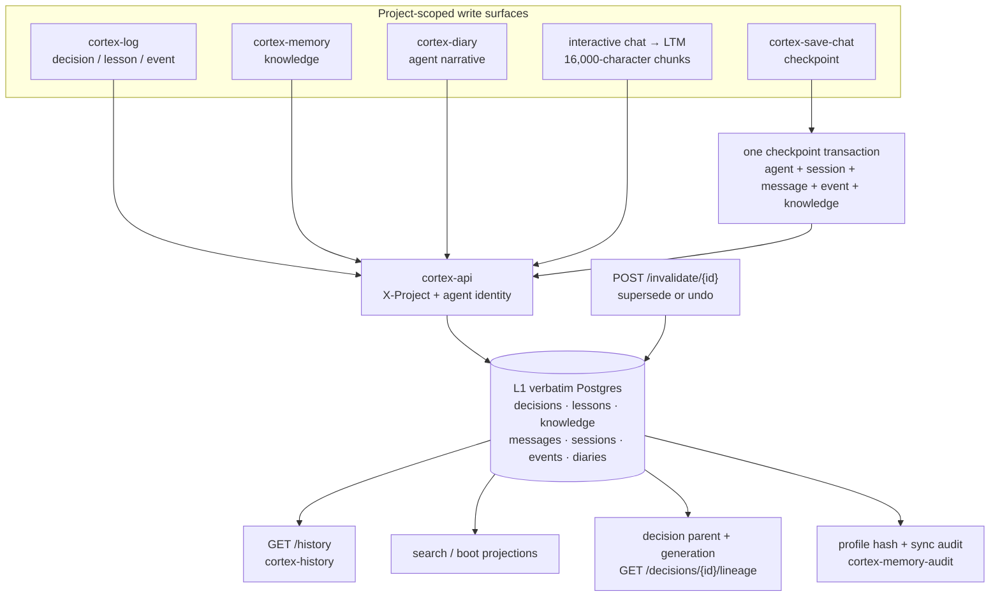

# Memory: durable history that survives the context window

**What it answers:** *what did the team decide, learn and do — and which version is still
current after a chat or process ends?*

> **Extraction status:** the Cortex v0.1.0 open-source extraction is in progress. This
> reference describes the evidenced kaidera-os lineage being extracted; a command named
> here may not yet be present in the current OSS checkout. It does not claim the separate
> platform lineage's MemPalace wing/room/hall hierarchy, Milvus L2 store, tenant-governance
> audit system or PROMI service. [M9]

## What it is

Cortex memory is a project-scoped Postgres record of decisions, lessons, knowledge,
messages, sessions, events and per-agent diary entries. L1 keeps the original text
verbatim; later retrieval and graph layers are projections, not replacements for that
record. The store exists because model context compaction permanently loses history and
file-based memory was observed to go stale. [M1]

The six-type taxonomy describes how the same records are used; it is not six independent
databases or six promises of automatic conversion. [M2]

| Memory type | Meaning in the source design | Principal surface |
|---|---|---|
| Working | what matters for this tick | `cortex-boot`, `cortex-bootstrap` |
| Episodic | what happened: events, sessions, handoffs and test runs | `cortex-history`, `cortex-search` |
| Semantic | what is currently asserted as true: decisions, knowledge and work products | `cortex-memory`, `cortex-log`, `cortex-brief` |
| Procedural | how the team acts: lessons, rules, skills and runbooks | `cortex-log … lesson …`, search |
| Structural | how code and remembered entities are connected | code graph and L4 knowledge graph |
| Provenance | why a record is trusted: its handoff, files, tests, agent and event chain | work-product and event receipts |

## How it works



`cortex-save-chat` is the explicit atomic checkpoint path: its five record groups land
together under project RLS. Interactive chat-to-LTM is a related but distinct path. It
writes completed turns into the same durable memory as autonomous work and splits long
turns at `CHAT_LTM_CHUNK_CHARS=16000`, labelling chunks
`<agent> CHAT <run_id> [i/N]`; it no longer truncates the tail. [M3]

Decision lineage follows `parent_decision_id` and `generation` to the root and back down.
Invalidation is broader: the server finds a decision, lesson or handoff by id, marks it
superseded, and can undo that change. Invalidated rows are excluded from search and boot by
default. [M4]

## Why it exists (the history)

- **Durability over context compaction.** The 2026-04-08 rebuild recorded that an LLM's
  compacted context permanently loses history unless it is written to a durable layer;
  the accompanying coordination finding was “file-based memory always goes stale, Cortex
  DB or nothing”. [M1]
- **Verbatim before lossy optimisation.** L1 deliberately retained raw, uncompressed text
  after AAAK compression caused a measured **12.4 percentage-point R@5 regression**. The
  source architecture records the rule as “quality > size at our scale”. [M5]
- **Checkpoints because normal chat was not being saved.** The checkpoint cadence was
  introduced after an audit found **7 outcomes but only 2 saves**. A later identity-v2
  defect then silently rejected every save-chat write because `project_id` was omitted;
  `dfe69482` fixed that on 2026-07-28. [M6]
- **Chat-to-LTM because app-local chat was disposable.** Interactive chat had lived only in
  the app database and vanished on a wipe, while the autonomous path silently cut text at
  `[:8000]`. v0.1.35 replaced truncation with the 16,000-character chunked ingest above.
  [M3]
- **Supersession because stale facts continued to retrieve.** More than **17 handoffs** had
  required manual archiving; invalidation was subsequently used to quarantine the **four
  polluted architecture decisions** from the 2026-04-17 scope-pollution incident. [M7]
- **Audit because profile memory can drift from identity.** The profile-hash audit shipped
  at genesis and was rebased on identity v2 in `b791c712` so its comparison uses the
  canonical agent identity. [M4]

## How to use it

The CLIs are the supported control plane; do not write the backing tables directly.
`cortex-log` uses positional arguments, and `cortex-diary` uses a `write` subcommand — not
the stale `--write` form found in an old rule example. [M8]

```bash
# Record current semantic and procedural memory.
cortex-log kai decision "Use the API-only write boundary for project memory"
cortex-log kai lesson "Measure retrieval quality before applying lossy compaction"
cortex-memory --agent kai --section "Release posture" \
  --content "Cortex v0.1.0 extraction is in progress" \
  --category operational --source "release review"

# Record and inspect episodic memory.
cortex-diary kai write --summary "Closed the memory documentation handoff" \
  --outcome completed --importance 7
cortex-diary kai --last 10
cortex-diary kai stats
cortex-save-chat kai "Documentation checkpoint" "Memory and lineage state recorded"
cortex-history --agent kai --last 20

# Supersede stale memory, or reverse the invalidation.
cortex-invalidate <old-id> --superseded-by <new-id> \
  --reason "Replaced by the reviewed decision"
cortex-invalidate <old-id> --undo

# Record one profile hash, then require current bundle and sync-event evidence.
cortex-memory-audit hash --agent kai
cortex-memory-audit audit --strict --notify
```

Decision lineage is exposed directly by the API:

```bash
curl --fail --silent --show-error \
  -H "X-Project: ${CORTEX_PROJECT}" \
  "${CORTEX_API_URL:-http://localhost:8501}/decisions/<decision-id>/lineage"
```

## What to set up

- A running Cortex deployment with its current schema and migrations applied; see the
  [deployment guide](../deployment.md).
- `CORTEX_PROJECT` must name the active project and the CLI must be able to reach
  `CORTEX_API_URL` (default `http://localhost:8501`). Normal writes also carry the acting
  agent identity. The API boundary is structural because direct superuser SQL previously
  bypassed RLS and misfiled data across projects. [M10]
- `cortex-memory-audit` additionally requires `CORTEX_ADMIN_TOKEN`; it uses admin-gated API
  endpoints to inspect profile bundles and memory-sync events. It is not a direct database
  client. [M4]
- Chat-to-LTM requires the interactive chat host integration (`app/chat_ltm.py`) as well as
  Cortex itself. Its session-history prompt reconstruction is separate from durable LTM.
  [M3]

## Limits (honest)

- **Verbatim is not automatically current.** A stored statement remains retrievable until
  a caller invalidates or supersedes it; lineage is implemented for decisions, not every
  memory type. [M4]
- **The six-type model is a taxonomy, not a completed assimilation engine.** The source
  design explicitly records that Cortex stores episodic memory well but does not enforce
  every episodic-to-semantic transition. [M2]
- **Session prompt memory is bounded independently of LTM.** Reconstructed chat history is
  oldest-first but capped at **8 turns / 12,000 characters** because non-interactive
  harness calls otherwise begin as fresh sessions; the durable chat chunks remain in LTM.
  [M3]
- **Audit scope is narrow.** `cortex-memory-audit audit --strict` proves there is at least
  one profile bundle, one agent represented and a memory-sync event in the previous 24
  hours. It does not prove that every decision is true or that retrieval quality is good.
  [M4]
- **Known source-lineage diagnostics are imperfect.** `cortex-save-chat` historically
  swallowed stderr, hiding silent failures; an invalidated item can still appear in a
  listing even though search excludes it; and the old diary example using `--write` is
  wrong. Use the forms above and read back important writes. [M6] [M7] [M8]
- The documented v0.1.0 extraction does **not** include the platform-only MemPalace
  wing/room/hall model, Milvus L2, tenant audit/governance or PROMI-as-a-service. [M9]

## Sources

- **[M1]** Census Appendix 5, “Postgres-backed agent memory store”: `project_cortex_v2.md`
  (Kai rebuild, 2026-04-08) and `feedback_agent_coordination.md`.
- **[M2]** Census Appendix 3, “6-type memory taxonomy”, citing `ARCHITECTURE.md` line 184
  and `docs/design/10-work-product-memory.md` §§2.3–2.4.
- **[M3]** Census Appendix 3, “Chat → LTM ‘never-forget’” and “Multi-turn chat session
  memory”, citing `console/CHANGELOG.md` v0.1.35–v0.1.36 (2026-06-07).
- **[M4]** Census Appendix 1, “Decision lineage”, “Invalidation / supersession” and “Memory
  audit”, genesis `35d5300c` and identity-v2 rebase `b791c712`; Appendix 2 memory-write and
  verification surface rows.
- **[M5]** Census Appendix 3, “L1 verbatim storage”, citing `local-cortex/ARCHITECTURE.md`
  lines 128–132, 270–285 and 365–373.
- **[M6]** Census Appendix 1, “Save-chat checkpoints” (`dfe69482`, 2026-07-28), and
  Appendix 5, “`cortex-save-chat` checkpoints”, citing `feedback_cortex_logging.md` and
  `feedback_cortex_logging_cadence.md`.
- **[M7]** Census Appendix 5, “Decision invalidation”, citing
  `reference_mempalace_patterns.md` and `project_e62_retrospective_2026-04-17.md`.
- **[M8]** Census Appendix 1, “Agent diary” and “Event/log write path”; Appendix 5,
  “Per-agent diary” and “`cortex-log` decisions/lessons”, including
  `feedback_cortex_script_invocation.md` (verified 2026-06-03).
- **[M9]** Census “Merged taxonomy → target docs” and “Platform-lineage areas”, lines
  63–90.
- **[M10]** Census “Why API-only”, lines 15–25 (REN-ARCH-01, asw-connect dogfood P0 and
  `3a2d6e5b`).
