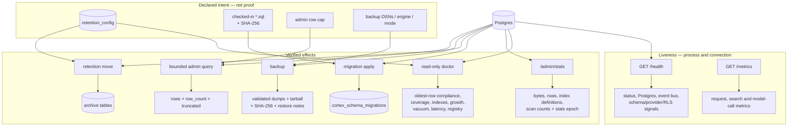

# Operations: prove the effect, not just the configuration

**What it answers:** *is Cortex merely alive and configured, or is the declared policy
actually taking effect on the stored data?*

> **Extraction status:** The v0.1.0 extraction is in progress. This reference is grounded
> in the shipped source and incident record; confirm that each named command is present in
> the extracted build before making it part of an operating procedure.

## What it is

Cortex has three deliberately separate operational truth levels:

| Truth level | Surface | What it proves |
|---|---|---|
| **Liveness** | `GET /health`, `GET /metrics` | The API process answers, Postgres can be reached, and the process exposes telemetry. |
| **Declared configuration** | `retention_config`, checked-in migrations, `CORTEX_ADMIN_SQL_MAX_ROWS`, backup DSNs and directory | What the deployment intends to do. A configured value is not evidence that anything used it. |
| **Verified effects** | `GET /admin/cortex/doctor`, `GET /admin/stats`, the migration ledger, archive move counts and backup dump/package checks | What is observably true of the database and the operation just performed. |

The distinction is load-bearing. `/health` can answer with HTTP 200 while its JSON body says
`status: degraded`; a retention row can say 90 days while 161-day-old messages remain; an
index can exist while receiving zero scans. Operators must inspect the effect surface, not
promote a green liveness probe or a declaration into proof.

## Why it exists (the history)

- **Doctor checks effects, not presence.** On 2026-08-30 the messages policy declared 90
  days, but the oldest row was **161 days** old: **1.78 million rows / 8.6 GB**. The doctor
  had reported OK because it only checked that the policy row existed. The repaired check
  compares `MIN(messages.ts)` with `tier2_days`, and reports that the policy is not being
  enforced (`a085fae2`). Earlier false positives were also removed: an idle deployment no
  longer warns on its own `pg_stat_activity` probe, and source-tree-only contract checks
  become `unknown` when the tree is unavailable rather than inventing a warning
  (`e4beaae2`).
- **Profiling made storage work measurable.** `/admin/stats` replaced improvised `psql` and
  exposed a 4.8 GB / 350k-row messages table, a missing trigram index and degenerate
  `ivfflat lists=1` indexes (`58144abf`). The first index programme reduced the database
  **7.3 → 5.0 GB (about 31%)** and improved `/search` by roughly **30–40%**. The opt-in
  halfvec programme measured **35/35 top-5 recall, zero loss**, and **7.3 → 4.6 GB (−36%)**.
  Scan counts later exposed five zero-read indexes occupying **641 MB** (`8210567e`,
  `45958c6c`).
- **Archiving became a move, not copy-then-hope.** The old two-statement path used `INSERT
  … ON CONFLICT DO NOTHING` and then independently deleted every eligible source row. A
  primary-key collision therefore skipped the insert but still destroyed the source. The
  repair returns the IDs that actually landed and deletes only those IDs
  (`INSERT … RETURNING`, `aa65b8f7`).
- **Migration state became a ledger.** Applied SQL is recorded with its filename, SHA-256,
  source path, actor, time, statement status and surface version. A checksum mismatch is a
  loud 409, not permission to replay edited history. Transactional migration SQL and its
  ledger row commit or roll back together.
- **Backup stopped assuming Docker.** A hard-coded `docker exec`/`docker cp` path silently
  broke after a container-engine cutover. Backup now tries a network DSN with host
  `pg_dump` first, then Docker, Podman or Apple Container `exec`, validates the custom dump
  header and size, and writes a SHA-256 and restore notes (`5dc364a7`, hardened by
  `b0f2fd0b`).
- **Admin queries became bounded.** A single large `fetch()` could materialise an entire
  result and OOM the API. `/admin/sql/query` now streams through a server-side cursor,
  stops at the configured cap, and returns `row_count` plus `truncated` (`d34f97ba`).

## How it works



The retention move is one database statement in shape:

```sql
WITH moved AS (
  INSERT INTO archive_messages (...)
  SELECT ... FROM messages WHERE ts < now() - interval '90 days'
  ON CONFLICT DO NOTHING
  RETURNING id
), pruned AS (
  DELETE FROM messages WHERE id IN (SELECT id FROM moved) RETURNING id
)
SELECT count(*) FROM pruned;
```

A conflicting row stays in the source for investigation. Silence is never interpreted as a
successful move.

## How to use it

Set the API and project once; administrative surfaces additionally require the generated
admin token:

```bash
export CORTEX_API_URL=http://localhost:8501
export CORTEX_PROJECT=my-project
export CORTEX_ADMIN_TOKEN='<generated secret>'
```

### 1. Separate liveness from effects

```bash
curl -fsS "$CORTEX_API_URL/health"
curl -fsS "$CORTEX_API_URL/metrics"

curl -fsS -H "X-Cortex-Admin-Token: $CORTEX_ADMIN_TOKEN" \
  "$CORTEX_API_URL/admin/cortex/doctor"
curl -fsS -H "X-Cortex-Admin-Token: $CORTEX_ADMIN_TOKEN" \
  "$CORTEX_API_URL/admin/stats"
```

Read the doctor's `status`, `summary` and each check's evidence. `mode: read_only` means it
reports assumed-state/actual-state gaps but never repairs them. In `/admin/stats`, treat
`unused: true` as an investigation prompt: confirm `index_stats_since` spans representative
traffic and that a working replacement exists before removing anything.

### 2. Inspect and apply checked-in migrations

```bash
cortex-apply-migrations --list
cortex-apply-migrations --dry-run
cortex-apply-migrations --apply --target 2026-06-15-identity-v2-1-foundation.sql
```

Dry-run is the default. `--max-count N` bounds a wave. Apply executes only migration files
from the mounted directory; the service rejects unsafe filenames, changed checksums and
unreviewed forward migrations that cannot share the ledger transaction.

### 3. Preview retention, then archive

```bash
cortex-retain --status
cortex-retain --dry-run
cortex-retain                    # current project
cortex-retain --all-projects     # explicit fleet-wide operation
```

After the move, re-read the doctor and retention status. The command's moved count proves
only how many rows landed and were deleted in that invocation; the oldest-row check proves
whether the declared window is now satisfied.

### 4. Create a recoverable backup

```bash
cortex-backup --full
cortex-backup --full --no-secrets
cortex-backup --db-only
```

The default full archive is a private recovery artefact and **includes secrets**. Use
`--no-secrets` for a shareable archive; `SECRET-SLOTS.txt` records names, never values, for
re-entry. The command emits a `.tar.gz`, `.sha256`, `RESTORE-NOTES.md` and a complete/partial
status. A partial database backup exits 2 and is not a recovery point.

### 5. Use the bounded SQL escape hatch deliberately

```bash
curl -fsS -X POST "$CORTEX_API_URL/admin/sql/query" \
  -H "X-Cortex-Admin-Token: $CORTEX_ADMIN_TOKEN" \
  -H 'Content-Type: application/json' \
  -d '{"sql":"SELECT id, status FROM handoffs ORDER BY created_at DESC LIMIT 100"}'
```

Check both `truncated` and `row_count`. The default cap is 10,000 rows and can be changed
with `CORTEX_ADMIN_SQL_MAX_ROWS`.

## What to set up

- A running Cortex API and Postgres deployment; only the API needs to be host-visible.
- A non-empty, generated `CORTEX_ADMIN_TOKEN` for doctor, stats, migrations and admin SQL.
- `CORTEX_MIGRATIONS_DIR` mounted to the checked-in migration directory (the packaged
  default is `/app/migrations`). Never edit an already-ledgered migration in place.
- Explicit `retention_config` rows and a scheduled `cortex-retain` run. Configuration alone
  is insufficient; alert on the doctor's oldest-row effect check.
- A Prometheus scrape of `/metrics` if historical telemetry is required. The current
  surface exports HTTP latency, embedding/rerank/analysis call counters, boot-cache
  hit/miss counters and per-stage search latency.
- For backup: `CORTEX_BACKUP_DIR`, reachable admin/app database DSNs and host `pg_dump`, or
  one supported container engine. The shipped full-deployment source currently includes
  both Cortex and its companion app database plus host configuration; verify the contents
  of the standalone v0.1.0 package during extraction.

## Limits (honest)

- `/health` is liveness, not a release gate, retention check, queue audit, backup proof or
  retrieval-quality proof. Inspect its JSON; HTTP success alone is deliberately weak.
- Doctor is point-in-time and read-only. `unknown` means evidence was unavailable; it does
  not mean OK. It cannot prove that a future scheduled run will happen.
- Index scan counts are lifetime counts only since `index_stats_since`; zero immediately
  after a PostgreSQL statistics reset is not evidence of a dead index.
- `cortex-retain --dry-run` proves eligibility, not successful insertion. Only the applied
  move plus an effect read can prove archival.
- A valid dump header, package checksum and restore notes prove the backup was captured and
  packaged, not that recovery meets an RTO/RPO. A restore drill remains necessary.
- `/admin/sql/query` bounds returned rows and API memory; it does **not** make arbitrary SQL
  safe, read-only or project-scoped. `/admin/sql/exec` is a separate unbounded mutation
  escape hatch. Both are admin-only last resorts, not an application API.
- Metrics describe what this API process observed. They do not replace database effect
  checks or durable incident evidence.

## Sources

Functionality census anchors 78, 130, 152–154, 175–177, 190 and 233; storage programme commits
`58144abf`, `8210567e`, `45958c6c` and halfvec measurement `9ffcf383`; safe archive repair
`aa65b8f7`; retention compliance repair `a085fae2`; doctor false-positive repair
`e4beaae2`; engine-agnostic backup `5dc364a7` / `b0f2fd0b`; bounded admin SQL `d34f97ba`;
observability shipment `02bc4908`. Current source surfaces: `GET /health`, `GET /metrics`,
`GET /admin/cortex/doctor`, `GET /admin/stats`, `GET|POST /admin/migrations*`,
`POST /admin/sql/query`, `cortex-retain`, `cortex-backup`, and
`cortex-apply-migrations`.
