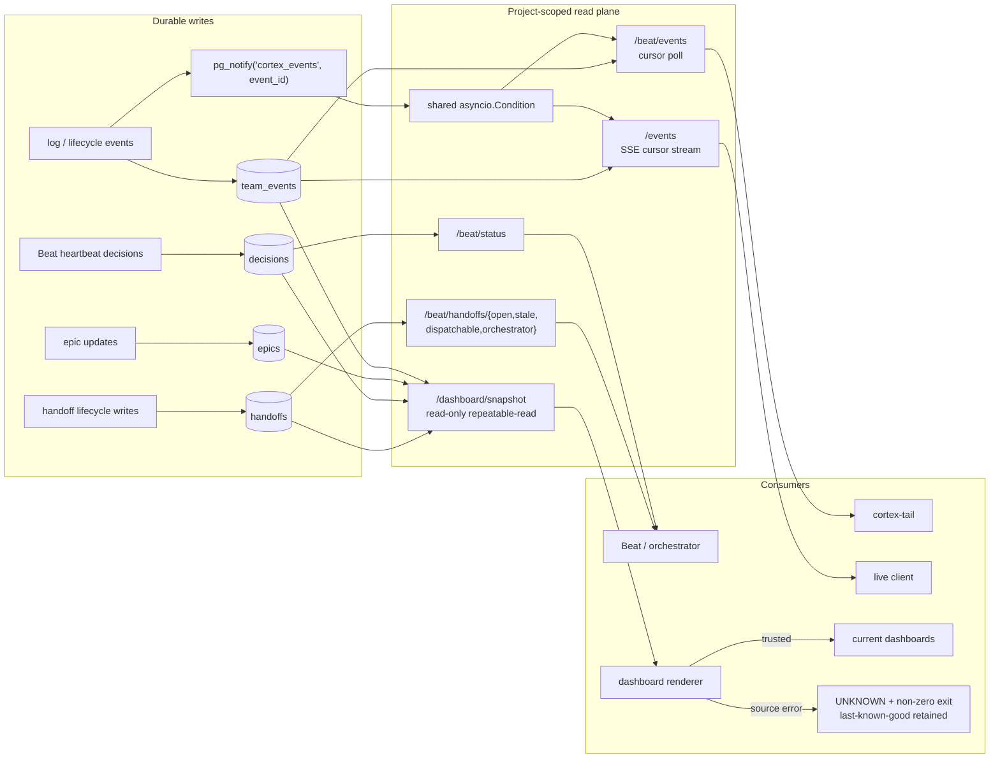

# Orchestrator feed: queues, events and dashboard truth

**What it answers:** *what should an orchestrator poll or subscribe to, and how does it
know that an empty response is truly empty rather than a failed read?*

> **Extraction status:** The v0.1.0 extraction is in progress. This reference is grounded
> in the shipped source and incident record; confirm that the named Beat commands and
> routes are present in the extracted build before wiring unattended automation to them.

## What it is

The orchestrator feed is the project-scoped operational read plane over durable Postgres
state. It provides:

- admin-gated `/beat/*` status, role, queue, deployment, embedding and event reads;
- purpose-specific handoff queues for open, stale, dispatchable and orchestrator-addressed
  work;
- a cursor-based event poller and a project-scoped Server-Sent Events (SSE) stream;
- one coherent `/dashboard/snapshot` for queue, heartbeat, epic and recent-activity truth;
- visible degradation state instead of treating repeated pattern failure as normal; and
- fail-loud clients and dashboard output when the source cannot be trusted.

The feed does not own the scheduler. It gives Beat, a dashboard or another orchestrator a
bounded, typed view of state that already exists in Cortex.

## Why it exists (the history)

- **Empty must not mean failed.** On 2026-07-28 the Markdown dashboard called `psql`, which
  was absent from `PATH`, swallowed the failure and rendered **“No open handoffs” against a
  23-deep queue** and **0% against every epic**. Silent-empty was indistinguishable from
  all-clear (`a601f9db`). `/dashboard/snapshot` and the fail-loud renderer now turn missing,
  malformed or inconsistent truth into `UNKNOWN`, exit non-zero and preserve the
  last-known-good files (`f8e8da44`).
- **Queue status became a contract.** The original `/beat/handoffs` status read was changed
  to fail loudly (`db5c8a32`) rather than green-washing an unavailable source. Current
  queue routes return typed rows and let database/auth failures remain failures.
- **Postgres became the event bus.** `team_events` is the durable event log; `pg_notify`
  carries only the new row ID as a wake-up signal. This replaced ephemeral Redis event
  streams during the E75 Phase 2 cutover. Consumers always re-read durable, project-scoped
  rows after a wake-up.
- **Degradation became queryable.** `pattern_metrics` records consecutive failures, total
  uses, successes and last success/failure times. `/degradation` lists repeatedly failing
  behaviour rather than hiding it behind aggregate liveness.

## How it works



`NOTIFY` is an acceleration signal, not the payload. One dedicated listener wakes all
waiters; each waiter reads `team_events` after its own numeric cursor with both RLS and an
explicit `WHERE project = …`. A notification for another project therefore yields no rows
and cannot advance this project's cursor.

## Queue contracts

| Route | Selection and order | Important bounds |
|---|---|---|
| `GET /beat/handoffs/open` | Pending or claimed, not invalidated, newest first | Created within `recent_days` (default 7); `limit` default 80, max 250. This is a recent operational window, not an all-history count. |
| `GET /beat/handoffs/stale` | Pending older than `pending_hours` (24), or claimed older than `claimed_hours` (12); includes row and claimed age | Separate thresholds; limit 1–100. |
| `GET /beat/handoffs/dispatchable` | Pending, not invalidated, addressed to one of the caller-supplied roles; priority then oldest first | Empty `roles` deliberately returns an empty queue; `recent_hours` defaults to 24; optional ID prefix. |
| `GET /beat/handoffs/orchestrator` | Pending or claimed work addressed to role `orchestrator` or `beat`; priority then oldest first | `status` must be `pending` or `claimed`; limit 1–100. |
| `POST /beat/handoffs/archive-stale` | Marks old pending handoffs `archived` and returns the affected IDs | Excludes completion handbacks; this is lifecycle housekeeping, not Tier-3 retention-table archiving. |

The role map at `GET /beat/roles` is derived from project `agent_profiles`; the literal
`orchestrator` role maps to no worker. Dispatch policy still decides whether and how a
returned row is spawned.

## Liveness, configuration and effects

Do not collapse these signals:

| Question | Read | Interpretation |
|---|---|---|
| **Is the service alive?** | `GET /health`; `/beat/status` heartbeat fields | Process/database reachability and recent observed heartbeat records. It does not prove queue completeness or successful dispatch. |
| **What did the operator declare?** | `X-Project`, role list, recent/stale/freshness query parameters, project runtime schedule | Scope and thresholds the read should apply. They are inputs, not outcomes. |
| **What effect is verified?** | Actual queue rows, numeric event cursor and rows, `/dashboard/snapshot` source/consistency fields, `/degradation` failure counts | Durable state observed for that project at read time. |

`/dashboard/snapshot` gathers its components inside one read-only, repeatable-read
transaction and labels the response `cortex.dashboard.snapshot.v1`. It reports queue counts
and bounded details, status-aware staleness, heartbeat age/freshness, epics and recent
`team_events`. The renderer rejects a wrong project, contract, source, consistency mode,
missing generation time, inconsistent counts, incomplete queue coverage or impossible
heartbeat state.

A dashboard is GREEN only when its snapshot is known and fresh and its queue conditions
permit GREEN. Data-source failure is `UNKNOWN`, never zero and never GREEN.

## How to use it

Set explicit project scope and the administrative credential:

```bash
export CORTEX_API_URL=http://localhost:8501
export CORTEX_PROJECT=my-project
export CORTEX_ADMIN_TOKEN='<generated secret>'
```

### Inspect queue and status truth

```bash
curl -fsS -H "X-Project: $CORTEX_PROJECT" \
  -H "X-Cortex-Admin-Token: $CORTEX_ADMIN_TOKEN" \
  "$CORTEX_API_URL/beat/status"

curl -fsS -H "X-Project: $CORTEX_PROJECT" \
  -H "X-Cortex-Admin-Token: $CORTEX_ADMIN_TOKEN" \
  "$CORTEX_API_URL/beat/handoffs/stale?pending_hours=24&claimed_hours=12&limit=20"

curl -fsS -H "X-Project: $CORTEX_PROJECT" \
  -H "X-Cortex-Admin-Token: $CORTEX_ADMIN_TOKEN" \
  "$CORTEX_API_URL/beat/handoffs/dispatchable?roles=developer,reviewer&recent_hours=24"

curl -fsS -H "X-Project: $CORTEX_PROJECT" \
  -H "X-Cortex-Admin-Token: $CORTEX_ADMIN_TOKEN" \
  "$CORTEX_API_URL/dashboard/snapshot"
```

Treat an HTTP error as unavailable truth. Also validate the expected response fields before
acting; do not substitute `[]` or zero on parse/schema failure.

### Poll events with a durable cursor

```bash
cortex-tail --once --count 20
cortex-tail --follow --last-id 12345 --count 50
```

`cortex-tail --once` asks for recent events. Follow mode carries the returned
`team_events.id` cursor forward and treats an explicit `error` field as failure. Direct
polling is also available:

```bash
curl -fsS -H "X-Project: $CORTEX_PROJECT" \
  -H "X-Cortex-Admin-Token: $CORTEX_ADMIN_TOKEN" \
  "$CORTEX_API_URL/beat/events?last_id=12345&count=50&team_events=true"
```

With no cursor and without `recent=true`, `/beat/events` establishes the current maximum ID
and returns no events. That means “start from now”, not “there is no history”.

### Subscribe over SSE

```bash
curl -N -H "X-Project: $CORTEX_PROJECT" \
  "$CORTEX_API_URL/events?last_id=12345&count=50&ping_seconds=15"
```

A numeric `last_id` resumes after that durable row ID. An empty or legacy non-numeric cursor
starts at the current project maximum, so only events created after connection are emitted.
Frames carry event type, ID and JSON data; idle connections receive `: ping` comments.
Transient database read failures arrive as SSE `error` events rather than fabricated empty
results. Apply the deployment's bearer authentication when JWT enforcement is enabled.

### Inspect degradation separately

```bash
curl -fsS -H "X-Project: $CORTEX_PROJECT" \
  "$CORTEX_API_URL/degradation"
curl -fsS -H "X-Project: $CORTEX_PROJECT" \
  "$CORTEX_API_URL/patterns?active_only=true&limit=20"
```

`/degradation` reports degraded `pattern_metrics`, ranked by consecutive failures.
`/patterns` is a different current surface: it lists captured patterns with type, quality,
generation and author. Do not infer failure counts from the pattern catalogue.

## What to set up

- A running Cortex API backed by Postgres. The current event bus requires no Redis service.
- An explicitly registered `CORTEX_PROJECT`; feed reads never guess a project.
- A generated `CORTEX_ADMIN_TOKEN` for `/beat/*` and `/dashboard/snapshot`.
- A durable consumer cursor for each polling/SSE consumer. Persist the last fully processed
  numeric event ID, not merely the last notification received.
- Dashboard output storage that permits `.last-known-good/` preservation, plus monitoring
  of the renderer's non-zero exit and `cortex-dashboard-source-error-v1` marker.
- Alerting on stale/absent heartbeat, stale queues, `/degradation`, SSE error frames and
  `/beat/events` error payloads. Keep each alarm distinct: one does not clear another.

## Limits (honest)

- `/beat/status` is feed-level evidence from stored heartbeat decisions, not an OS-level
  proof that a daemon process is healthy. Its aggregate `stale` count uses a fixed 24-hour
  created-at rule; use `/beat/handoffs/stale` or the snapshot for separate pending/claimed
  thresholds.
- Queue endpoints are bounded operational views. `open` defaults to the last seven days;
  `dispatchable` defaults to 24 hours and returns empty when no roles are supplied. Use the
  contract intentionally before interpreting emptiness.
- `pg_notify` is not durable delivery. A disconnected listener can miss wake-ups, so replay
  comes from `team_events` and the consumer's numeric cursor.
- SSE without `last_id` intentionally omits history. Keep-alive comments prove that the
  connection is moving, not that events or handoffs exist.
- `/beat/events` currently represents read failure with an `error` field in a JSON response;
  callers must reject that field even if transport succeeded. The supplied `cortex-tail`
  does so.
- A coherent dashboard snapshot proves one point-in-time read. It does not prove that a
  later dispatch, scheduled job or dashboard write succeeded.
- `/degradation` is only as complete as writers to `pattern_metrics`; absence of a degraded
  row is not a universal health guarantee.

## Sources

Functionality census anchors 79, 155–157, 162 and 219; dashboard incident and generator
`a601f9db`; fail-loud snapshot contract `f8e8da44`; Beat status correction `db5c8a32`;
Postgres event-bus contract (E75 Phase 2); current source routes
`GET /beat/{status,roles,events}`, `GET /beat/handoffs/{open,stale,dispatchable,orchestrator}`,
`POST /beat/handoffs/archive-stale`, `GET /events`, `GET /dashboard/snapshot`,
`GET /degradation` and `GET /patterns`; current consumers `cortex-tail` and
`cortex_dashboard_md.py`.
