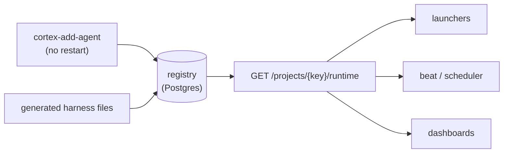

# Registry: projects, identity, and runtime authority

**What it answers:** *who exists, in which project, with what role — and which single
source do launchers, dashboards and schedulers trust?*

## What it is

The registry owns three fact families, all data, none baked into config files:

| Family | Facts |
|---|---|
| **Projects** | key, display name, status, canonical `repo_root`, roster policy, writer allow-lists |
| **Identity** | workers as `name@project` — corruption-proof v2 identities with alias resolution |
| **Runtime** | the profile launchers and schedulers consume: roster with models/capabilities, heartbeat cadence, launch surfaces |



## Why it exists (the history)

- **Runtime authority (2026-05-16):** launchers once hardcoded project keys, roots and
  rosters; a stale local config could — and did — silently unregister unrelated projects.
  Now `GET /projects/{key}/runtime` is the single source; workspace JSON is an
  import/export surface only, and sync **never prunes** without an explicit
  `--prune-missing`.
- **Identity v2 (2026-06-15):** denormalised hex-suffixed identities corrupted; v2 keys
  everything on `project_id` FKs with `agent@project` display, rejects legacy colon/hex
  forms at the write path (400), and resolves old aliases read-only.
- **Cross-project contamination (2026-06-07):** a workspace sync raw-INSERTed roster rows
  from another project's identity files *on every sync*. Registration now goes only
  through the caller-gated API, with a regression test standing guard.
- **History is never deleted:** removing a worker *deactivates* the roster row —
  idempotent, reversible, memory intact. Phantom rows are demoted the same way; a registry
  doctor lists drift and stays dry-run without `--confirm`.

## How to use it

```bash
cortex-init-project my-product --workspace-root ~/work/my-product
cortex-add-agent alice --role lead          # live immediately, no restart
cortex-roster                               # who exists, with roles
cortex-project --set-repo-root /path        # the canonical working folder
cortex-export-project / cortex-import-project / cortex-merge-projects
cortex-registry-doctor                      # drift report, dry-run by default
```

Portability is proven, not promised: export/import moved a real project — 91,340 rows,
15 tables, embeddings included — with per-table manifest parity at cutover. The merge tool
carries a scar worth knowing: an early version silently dropped artifacts, diaries and
work products; verified-by-content is the rule since.

## Limits (honest)

- Roster policy patches **fail loud** (off-roster responsibility holders → 422, never a
  silent 200).
- `repo_root` is a declaration the host must honour; autonomy checks it before spawning.
- Import requires a pre-registered target project — no implicit creation.

## Sources

Registry/runtime authority E75 Inc 18 (2026-05-16, `600546ff…`); identity v2 `b791c712`
(2026-06-15); contamination guard `3a2d6e5b` + test; migration proof 2026-07-18 (90,974 →
91,340 rows, 6/6 parity); merge data-loss fix `e65977ff`.
