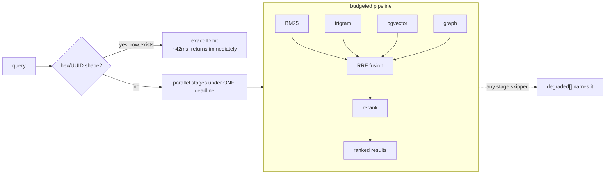

# Search: hybrid retrieval under an honest budget

**What it answers:** *find the right row across everything the team ever recorded — and
say so plainly when a stage could not run.*

## How it works



- **Stage −1, exact-ID:** a hex/UUID query matching a real row id returns at once — the
  full sweep is what once made `/search` ~2s and OOM-killed the CLI on large projects.
  Measured: 42ms vs 2.76s (~65×). One honest note: messages and knowledge were silently
  *unreachable* by this path for months — a per-table timestamp-column drift swallowed by a
  bare `except` — fixed 2026-09-01; a failed probe now reports `exact-id:<table>` in
  `degraded[]`.
- **The budget is one monotonic deadline across all stages**, with per-stage statement
  timeouts. A skipped stage lands in `degraded[]` — silence is never an answer.
- **Rerank runs last** — and that once meant it *never* ran: BM25 ate the whole budget on
  every cold query for weeks while search "worked", degraded. The fix was making BM25 fast
  (an RLS SECURITY DEFINER bridge took the wall from 4.55s to 1.30s), after which rerank
  ran on 6/6 cold queries. Then measurement overturned the next theory too: with fast
  stages, the *query-embedding provider call* dominated latency — hence the embedding
  cache.

## Why the honesty machinery exists

Incident `912073e2` (2026-07-29): an unindexable predicate plus unbounded stages produced
**362 full-cluster PostgreSQL crash recoveries in 14 hours — while every service reported
healthy and `/health` returned 200.** The fixes are structural: bounded stages, the shared
deadline, a bulkhead that sheds load with typed 503s instead of cascading, and a
**soak gate** (`cortex-search-soak`) that drives real concurrent traffic with forced
mid-flight disconnects and reads the cluster's own logs — exit 0 pass, exit 2
"could not run" (never a pass). A green healthcheck is exactly what masked the incident.

## How to use it

```bash
cortex-search "volume ownership uid"        # hybrid, reranked, project-scoped
cortex-search 585fd83f                      # exact-ID fast path (handoff/row ids)
cortex-search "queue design" --no-rerank    # skip the external rerank call
```

Graph-first for broad/thematic questions, plain search for exact strings — an A/B over 20
real queries showed 82.9% token reduction and better precision on themes, with 4/20
exact-string losses; that split is the standing rule.

## What to set up

Embedding + rerank providers ([models](../models.md)): Ollama self-hosted, NVIDIA free
tier, or OpenRouter. Rerank ids are exact strings — OpenRouter free models need the
`:free` suffix, and a listed model is not a routable model; only a live call proves one.
Turning rerank off stops the external egress without disabling vector search.

## Sources

Exact-ID fast path `aeea4ade` (2026-06-03); rerank starvation + SECURITY DEFINER fix
`7263ae03`/`57648e7f` (2026-08-16); provider-call latency measurement `30ddb8d0`
(2026-08-02); incident 912073e2 remediation `5747828c`/`8fff6ea8` (2026-07-29); soak gate
`f9f7a2a1`; exact-ID column drift fix (2026-09-01, public-RC hold 12).
