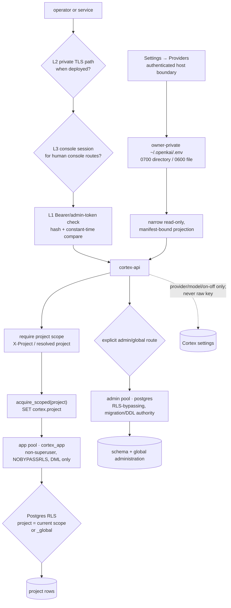

# Security: credentials, scope, and least privilege

**What it answers:** *which boundary protects Cortex at each hop, where do secrets live,
and which controls are shipped rather than architectural intent?*

> **Extraction status:** the v0.1.0 extraction is in progress. This document separates
> production-lineage evidence from the standalone payload. A lineage command or deployment
> layer is not a v0.1.0 guarantee until it appears in the published payload and discovery
> document.

## What it is

Cortex security is defence in depth, not one “secure” switch. The four-layer architecture
covers application tokens, network transport, human console access, and platform service
identity. Project-scoped database access, the runtime/admin pool split, credential custody,
and ingress guards sit underneath or beside those layers.

| Layer | Boundary | Evidence-backed status |
|---|---|---|
| **L1 — application auth** | Per-install high-entropy tokens; named-token design stores SHA-256 hashes and compares presented credentials in constant time. The lineage names Settings → Cortex Access and `cortex-token` as the management surface. | The per-install admin-token foundation and rejection of the weak `cortex-local-admin` default are operational. Source records disagree on whether named-token GUI/CLI packaging is complete; treat that surface as extraction-gated, not silently available. |
| **L2 — network security** | Tailscale/WireGuard plus Let's Encrypt TLS; services bind privately rather than exposing plaintext HTTP. | Design locked and deployment/platform-gated; not a local v0.1.0 guarantee. |
| **L3 — human authentication** | Console activation/login and hashed session tokens; the integrated lineage includes passwordless email code/link and optional passkeys. | First-party integrated-console evidence exists, but local single-user mode normally leaves it off. It is not equivalent to Cortex API token auth and is not yet a standalone-payload claim. |
| **L4 — service identity** | PKI/mTLS gives each platform service an X.509 identity in addition to L1 credentials. | Platform only; not implemented or required for local Cortex. |

The database boundary is separate from the numbered four-layer model. It prevents a
project-scoping mistake in an API handler becoming an unrestricted row read:



`cortex_app` receives DML grants but no schema-creation authority. `pool_app` sets the
project session variable consumed by RLS; `pool_admin` owns migrations and the few
explicitly global/admin operations. RLS is effective only when the app DSN really uses a
non-superuser, non-`BYPASSRLS` role. Startup probes that property, exposes it in health,
and can refuse startup when `CORTEX_REQUIRE_RLS` is set.

## Why it exists (the history)

- **The default token was not a boundary.** Early remote installs shared the known
  `cortex-local-admin` value, with no rotation or hash-at-rest lifecycle. The L1 design
  replaced it with per-install high-entropy credentials and a named, rotatable, revocable
  token model. SHA-256 is used for lookup/verification so the stored value is not the
  bearer secret itself; plaintext is shown only at creation/rotation in the named-token
  design.
- **Single-home custody fixed real drift.** A recurring “Cortex didn't register the
  project — admin token configured” failure came from the console reading a stale token
  baked into its systemd unit while `cortex-api` read `local-cortex/.env`. The compatibility
  `CORTEX_ADMIN_TOKEN` now has one gitignored, mode-`0600` home; the console reads it at
  request time and Beat's wrapper loads it at execution time. A missing token fails the
  admin surface closed.
- **RLS needed a non-superuser client.** Postgres superusers bypass row-level security, so
  policies alone were theatre. Phase C introduced `cortex_app` (`NOSUPERUSER`,
  `NOBYPASSRLS`) for scoped runtime requests and kept a separate superuser pool for
  migrations and genuinely global administration. The API probes the effective role so a
  fallback to superuser is loud rather than false-green.
- **DDL belongs to the admin pool.** Embedding-backfill and graph-build job-ledger helpers
  once ran `CREATE TABLE` on the scoped app connection. Every asynchronous job on marlow
  failed with `permission denied for schema public`; the synchronous path stayed green
  because it never touched the ledger, and a stubbed async test never executed the DDL.
  Commit `8638b243` removed the connection parameter and made each helper acquire the admin
  pool itself. Regression tests assert that no DDL reaches the app pool.
- **Provider keys needed one owner, not another store.** A key entered in Settings could
  test successfully while embedding still failed because the console and Cortex had
  separate credential planes. The custody contract puts KOS/OpenKai provider keys only in
  owner-private `~/.openkai/.env`. `cortex-api` receives a narrow read-only,
  manifest-bound projection and verifies its masked revision with the host companion.
  App settings, process environment, and `local-cortex/.env` are not credential fallbacks.
- **A fix without a gate regressed.** `check-no-token-baking.sh` rejects installer code
  that re-embeds `$ADMIN_TOKEN`; `check-no-hardcoded-token.sh` rejects a quoted 32+-character
  token literal assigned to an admin-token variable in tracked non-test code. They freeze
  the single-home lesson into executable policy.
- **Ingress validation must be behaviourally true.** Write paths reject retired
  colon/hex identity forms, mismatched `agent@project` identities, non-ASCII handoff
  summaries, invalid project keys, and malformed/non-string ingress tokens before mutation.
  The rules are compatibility and corruption guards, not a substitute for authentication.
- **Locale made 45 guards lie.** Shell ranges compare in collation order. Under
  `en_US.UTF-8`, `[a-f]` can include `A-F`, so a guard written to reject an uppercase
  revision accepted it on a typical host while the identical container code worked under
  the POSIX locale. Commit `1c2efdaf` fixed the entry boundary once with
  `unset LC_ALL; export LC_COLLATE=C`, leaving `LC_CTYPE` alone so non-ASCII project names
  still round-trip. The regression proof executes the real guard under both locales.

## How to use it

### Tokens

The production lineage defines this named-token lifecycle:

```bash
cortex-token create --name beat-loop    # plaintext appears once
cortex-token list                       # metadata/masked identity, never secret/hash
cortex-token rotate --name beat-loop    # old credential invalid immediately
cortex-token revoke --name beat-loop
```

Because the tracked security design and census disagree about whether that GUI/CLI is
already packaged, first confirm `cortex-token` appears in your installed discovery/command
surface. Do not replace an absent command with direct database writes.

For an extraction/build still using the compatibility admin token:

```text
local-cortex/.env   mode 0600
CORTEX_ADMIN_TOKEN=<one high-entropy per-install value>
```

Keep it out of source, unit files, LaunchAgent plists, process arguments, handoffs, logs,
and documentation. The console and API must resolve the same canonical file at runtime;
a masked hint may be displayed, never the value.

### Provider credentials

Use **Settings → Providers** in the integrated lineage. That authenticated host path writes
`~/.openkai/.env` atomically and checks owner, file type, symlink status, directory mode
`0700`, file mode `0600`, and optimistic revision. Settings → Cortex stores only the
selected provider, model, bounds, and enabled state. Never copy a provider key into
`local-cortex/.env`, app settings, a service environment, or a fallback code path.

When reranking is enabled, the bounded search query and candidate passage text leave the
machine for the configured provider. Turning reranking off stops that call without
disabling vector search; credential custody is not a promise of zero data egress.

### RLS and the pool split

Provision schema/roles through the supported bootstrap or migration surface, then configure
separate DSNs:

```text
CORTEX_PG_DSN_APP=postgresql://cortex_app:…@cortex-pg:5432/platform_agent_memory
CORTEX_PG_DSN_ADMIN=postgresql://postgres:…@cortex-pg:5432/platform_agent_memory
CORTEX_REQUIRE_RLS=1
```

Project handlers must use `acquire_scoped(project)`; migrations, grants, extensions, and
job-ledger schema creation use only the admin/migration path. Read `/health`/the discovery
surface and require `rls_enforced=true` before treating RLS as an active control. Applying
an RLS migration while the app pool still connects as `postgres` does not enforce row
isolation.

### Fitness and entry-point gates

The lineage's release/CI security gates are:

```bash
scripts/fitness/check-no-token-baking.sh
scripts/fitness/check-no-hardcoded-token.sh
```

Host shell entry points that use bracket-range validation must clear an inherited `LC_ALL`
and pin `LC_COLLATE=C` **before the first guard**. Pin collation, not every locale category.
Container entry points should make the same property explicit rather than rely on the base
image's default.

## What to set up

1. Generate a unique high-entropy admin credential during installation; never ship the
   historical default. Use named tokens for separate clients when that surface is present,
   so revocation need not rotate every consumer.
2. Keep the compatibility runtime-secret file gitignored and `0600`; keep provider keys in
   the separate owner-private authority. Rotate any credential that has appeared in a unit,
   plist, log, tracked file, or handoff, then prove the old value is rejected without
   recording either value.
3. Bootstrap `cortex_app`, `cortex_reader`, and test roles before opening the API app pool.
   Apply captured schema and Phase C policies through the admin migration path; do not grant
   `CREATE` on `public` to make a broken request path pass.
4. Set the app DSN to `cortex_app`, the admin DSN to the migration authority, and enable the
   fail-loud RLS requirement. Ensure each scoped connection sets `cortex.project` and resets
   session state before it returns to the pool.
5. Bind the local API to loopback. If operating remotely, add an actually deployed private
   transport/TLS layer; the L2 design being documented does not configure it for you.
6. Decide whether the console's L3 login surface is part of your deployment. A local OS
   account and loopback binding may be the intended single-user boundary; a shared/remote
   console needs explicit human authentication.
7. Run the token fitness gates in the release pipeline and behavioural locale checks for
   every shell entry point. Static source inspection cannot prove a locale-dependent guard.

For install availability and the v0.1.0 payload gate, see the
[deployment process](../guides/deployment-process.md).

## Limits (honest)

- “Four layers” is an architecture, not a claim that all four ship locally. L2 is
  deployment-gated, L4 is platform-only, and L3 integrated-console evidence does not make
  it part of the standalone Cortex API.
- Hashing protects stored token material; it does not stop replay of a stolen bearer token,
  an online guessing attack, or a process that can read plaintext before hashing. The
  design depends on high-entropy generated secrets, constant-time comparison, transport
  protection, rotation, and least privilege together.
- The named-token management surface has conflicting lineage records: the census calls it
  operational while the tracked low-level design still lists its GUI/CLI as follow-on.
  The standalone extraction therefore must discover and prove it before advertising it.
- RLS is a project-isolation backstop, not complete tenant governance. `_global` rows are
  deliberately visible across project scopes, and the admin pool deliberately bypasses
  RLS. A leaked admin DSN or an incorrectly classified route crosses that boundary.
- Policies do nothing for a superuser/`BYPASSRLS` app connection. `rls_enforced` must be
  observed, not inferred from migration files.
- The provider projection reduces copies; it is not a credential vault, HSM, or guarantee
  against a compromised host companion. Revision mismatch must fail visibly rather than
  fall back to another secret source.
- The two token fitness scripts detect two specific regression shapes. They are not a
  general secret scanner and do not prove that logs, artefacts, process memory, or history
  contain no credentials.
- Input guards constrain known bad forms; they do not authenticate a caller, authorise an
  action, sanitise arbitrary content, or replace typed API contracts.
- Collation pinning makes shell byte-range checks deterministic. It does not validate the
  semantic meaning of a token, revision, digest, identity, or project key.
- Tenant roles/governance, commercial quotas/billing, and PROMI SaaS controls belong to
  platform lineage and are not v0.1.0 OSS claims.

## Sources

- Census anchors: `FUNCTIONALITY_CENSUS.md` rows **187**, **314–321**, **415**,
  **517/523–524**, and **579**.
- Four-layer design: `docs/design/09-security-architecture.md` (2026-06-14), especially
  status line 4, L1 §§2.1.1–2.1.8, phasing §5, and L4 §2.4.
- RLS: `.agents/data/migrations/2026-05-08-phase-c-cortex-app-role.sql`,
  `2026-05-08-phase-c-rls.sql`, and `2026-05-09-phase-c-rls-audit-extension.sql`.
- Pool enforcement: `.agents/api/main.py` (`PG_DSN_APP`, `PG_DSN_ADMIN`,
  `detect_rls_enforced`, `acquire_scoped`) and
  `.agents/api/tests/test_job_ddl_uses_admin_pool.py`; DDL fix `8638b243`.
- Provider custody: `local-cortex/CORTEX_KEYS.md` §§Credential authorities and
  Cortex's read-only provider projection (updated 2026-08-19).
- Token custody gates: `scripts/fitness/check-no-token-baking.sh` (v0.1.89) and
  `check-no-hardcoded-token.sh` (v0.1.94).
- Ingress and locale: `test_agent_name_guard.py`, `test_project_key_validator.py`,
  `test_identity_v2_ingress.py`; non-ASCII handoff guard `18a17b14`; identity guard
  `b791c712`; collation pin `1c2efdaf`; appliance qualification finding F33.
