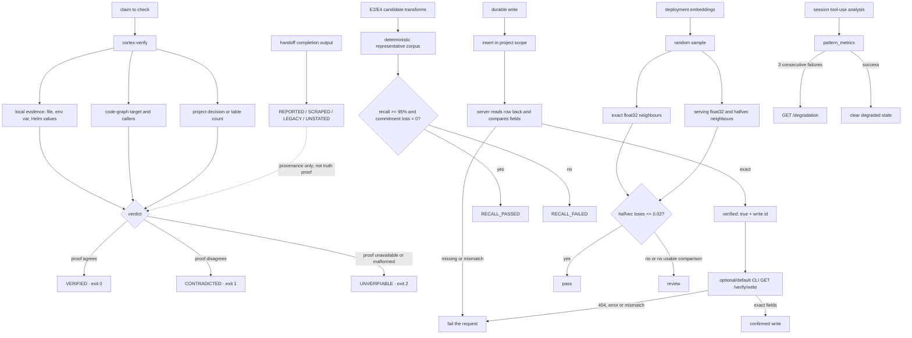

# Verification: prove claims, writes and recall

**What it answers:** *what did Cortex actually check, what evidence did it obtain, and what must remain unclaimed when proof is unavailable?*

> **v0.1.0 extraction status:** the extraction is in progress. The verification surfaces
> documented here run in the Kaidera OS source today; this page is the contract they must
> retain when they land in this standalone repository.

## What it is

Cortex has several deliberately separate verification mechanisms. They do not collapse
reported evidence, persisted data and behavioural proof into one misleading “verified”
badge.

| Mechanism | What it proves | Surface |
|---|---|---|
| Claim checks | A stated, checkable assertion agrees with the selected code, local or project-scoped runtime source | `cortex-verify` |
| Write fidelity | A durable row can be read back from the same project, with load-bearing fields unchanged | write handlers, `GET /verify/write`, and confirming CLIs such as `cortex-log` |
| Write-side recall gate | E2 distillation and E4 symbolic compaction preserve protected tokens and lose no commitment sentences on the deterministic corpus | `.agents/api/ingest/recall_gate.py` |
| Vector recall gate | Half-precision retrieval remains within the measured recall delta from float32 on this deployment’s embedded data | `GET /admin/recall-check` |
| Evidence class | How a handoff completion report was obtained, not whether its claims are true | `cortex-handoff --show` |
| Pattern/degradation signal | Which captured patterns exist and which measured command patterns have repeatedly failed | `GET /patterns`, `GET /degradation` |

## Why it exists (the history)

- **An anti-hallucination surface from genesis.** Commit `35d5300c` (2026-06-02)
  introduced `cortex-verify` to check claims against files, the code graph, project memory
  and runtime state rather than accepting fluent text as proof.
- **Recall gates replaced assertion by measurement.** The E3 read-side gate landed first
  in `3e8e43e6` (2026-06-22). Commit `c20b26c2` (2026-06-25) then replaced a placeholder
  E2/E4 gate with a deterministic benchmark whose hard condition is protected-token recall
  of at least 95% **and zero commitment loss**. The production halfvec migration recorded
  35/35 top-five recall while reducing the measured database footprint by 36%
  (`9ffcf383`).
- **Writes are confirmed by reading effects, not trusting HTTP success.** The API reads
  newly inserted decisions, lessons, team events and handoffs back and compares their
  project and payload fields. `cortex-log` additionally requires `verified: true` and,
  by default, calls `GET /verify/write` to compare the summary, event type and files
  exactly. The read-back endpoint now covers decisions, lessons, handoffs, team events,
  knowledge, artifacts, diaries, sessions, messages and work products.
- **Evidence was renamed honestly.** Commit `201d9292` (2026-07-29) surfaced a field that
  had three writers and no reader. It labels completion evidence **REPORTED**, **SCRAPED**,
  **LEGACY** or **UNSTATED**. It is intentionally not called “verified”: all four describe
  provenance of an agent’s report, not independent proof.
- **Repeated failure became visible.** `pattern_metrics` has existed since `35d5300c`.
  Current analysis increments uses, successes, failures and consecutive failures; three
  consecutive failures mark a command pattern degraded, while a subsequent success clears
  that degraded state.

## How it works



The boundaries matter. A persisted row can be faithfully written but factually wrong. A
structured handoff report can be clearly **REPORTED** but still unproven. A recall gate can
prove its measured preservation condition without proving the factual content being
stored.

## How to use it

### Check a claim

Prefer a structured check whose evidence source matches the assertion:

```bash
cortex-verify --file-exists ./src/cortex/api.py
cortex-verify --function-exists execute_search --repo .
cortex-verify --callers execute_search --min 2 --repo .
cortex-verify --decision "halfvec migration"
cortex-verify --table-has-rows decisions --min 1
cortex-verify --env-var CORTEX_PROJECT
cortex-verify --helm-key CORTEX_PROJECT --values ./values.yaml
cortex-verify "The implementation is in /absolute/path/file.py"
```

Treat the result as a three-way outcome:

| Exit | Meaning | Operator response |
|---:|---|---|
| `0` | The selected check found agreeing evidence | Cite that evidence and its scope. |
| `1` | The selected check found contradictory evidence | Correct the claim; do not retry as though this were a transient error. |
| `2` | The claim could not be proved: no checkable assertion, unavailable/unbuilt graph, malformed response, missing values file or invalid input | Repair the evidence path or leave the claim explicitly unverified. Never turn this into a pass. |

Free-form mode extracts a bounded set of file paths and function-like names, then looks for
related decision terms. It is a convenience for triage; use the structured modes for a
load-bearing gate.

### Confirm a write

```bash
cortex-log kai decision "Use halfvec only after the recall gate" docs/models.md
# --confirm is the default: API fidelity check, then GET /verify/write, then exact comparison

cortex-log --no-confirm kai started "Backfill started"
# skips the second client read-back only; the API must still return verified: true
```

For API consumers, retain the returned write ID and read it through:

```text
GET /verify/write?kind=<kind>&id=<write-id>
X-Project: <project>
```

Supported kinds are `decision`, `lesson`, `handoff`, `team_event`, `knowledge`, `artifact`,
`diary`, `session`, `message` and `work_product` (also `work-product`). An unsupported kind
is a 400; a row absent from the named project is a 404. Server-side fidelity failure is a
500 rather than a successful response with a warning.

### Run recall gates

The E2/E4 gate is deterministic and has no LLM dependency. In the Kaidera OS source
checkout, run the actual source entry point from the repository root:

```bash
python3 .agents/api/ingest/recall_gate.py
python3 .agents/api/ingest/recall_gate.py --json
```

This is a **source-tree invocation**, not a standalone v0.1.0 entry point. Do not advertise
it as installed until the extracted package and discovery surface name a tested command.
The gate protects file paths, UUIDs and backtick code spans, checks commitment-bearing
sentences, and reports storage reduction without allowing reduction to compensate for lost
commitments. Exit 0 means `RECALL_PASSED`; exit 1 means `RECALL_FAILED`.

The admin-only E3 gate samples real embedded rows and compares float32 and halfvec top-k
neighbours with an exhaustive float32 baseline:

```text
GET /admin/recall-check?tables=messages,decisions,knowledge,lessons&n=200&k=8&project=<project>
```

Enable halfvec only on `overall_verdict: "pass"`. Per-table errors, an empty sample or no
usable deltas produce `review`, never a pass.

### Read evidence and degradation honestly

Use `cortex-handoff --show <id>` to see the completion evidence class. **REPORTED** means a
structured result block; **SCRAPED** means recovery from loose output; **LEGACY** means an
old success marker; **UNSTATED** means no class was recorded. None certifies the work.

`GET /patterns` lists captured active patterns (optionally filtered by type).
`GET /degradation` lists degraded command-pattern metrics, ordered by consecutive failures,
with total uses, successes and last success/failure timestamps. Use degradation as a
warning to investigate behaviour, not as a replacement for reproducing the failure.

## What to set up

- A running, project-scoped Cortex API and the normal CLI environment (`CORTEX_PROJECT`,
  API URL and the appropriate token). Claim checks for decisions, tables and graph data go
  through the typed API rather than direct superuser SQL.
- A built, reasonably fresh code graph before relying on function or caller checks.
- Admin access for `/admin/recall-check`; it is deliberately read-only but inspects
  deployment data through the admin pool.
- The E2/E4 ingest modules and their representative corpus in the extracted Python package
  before using the deterministic gate as a release condition.

No extra setup turns reported handoff evidence into independent verification; that requires
a separate check against the acceptance criterion and the changed surface.

## Limits (honest)

- `cortex-verify` proves only the selected assertion against the selected source. Local file,
  environment and Helm checks describe the machine and values file where the command ran.
- Helm-key mode performs a literal text search; it does not evaluate rendered Helm values or
  prove that a deployment consumed the key.
- Code-graph evidence inherits static-analysis and freshness limits. A missing target is
  contradictory only when the graph returns a sound `not_found`; unavailable, ambiguous or
  malformed graph results are **UNVERIFIABLE**.
- Decision verification is a case-insensitive substring search over active decisions in one
  project. A zero count contradicts that exact lookup, not every possible semantic wording.
- Table checks prove row counts, not row quality. Write read-back proves persistence and
  selected field fidelity, not downstream effects or factual truth.
- The E2/E4 corpus is deterministic and representative, not exhaustive. Any new transform or
  message shape requires corpus coverage before the same threshold can carry the same weight.
- The E3 gate uses a random sample of current embedded rows. Record its parameters and result;
  a pass on one data distribution is not a permanent waiver for later model/index changes.
- Pattern capture and metric updates are best-effort during session analysis: insert/update
  errors do not fail the analysis request. Absence from `/patterns` or `/degradation` is
  therefore not proof that a behaviour never occurred.
- Extraction is still in progress. Until v0.1.0 lands the implementation, commands and
  routes cited here remain production-source evidence and a standalone release contract,
  not an assertion that this repository already ships them.

## Sources

- Functionality census: `Program/Release_v0.1.0/E021_CORTEX_INDEPENDENT_PRODUCT/FUNCTIONALITY_CENSUS.md`, rows **Recall gate**, **halfvec quantization + `/admin/recall-check`**, **Evidence class on completions**, **Degradation monitoring**, **Event/log write path with read-back confirmation**, and **Claim verification**; Appendix 2, **Verification & memory quality**.
- Claim verifier and exit semantics: `.agents/scripts/cortex-verify`.
- Write fidelity and read-back coverage: `.agents/api/main.py` (`verify_memory_write_persisted`, `verify_team_event_persisted`, `verify_handoff_persisted`, `GET /verify/write`) and `.agents/scripts/cortex-log`.
- Deterministic E2/E4 gate: `.agents/api/ingest/recall_gate.py`; history `c20b26c2`.
- Deployment E3 gate: `.agents/api/main.py` (`GET /admin/recall-check`); history `3e8e43e6`, measured halfvec migration `9ffcf383`.
- Evidence classes: `.agents/scripts/cortex-handoff`; history `201d9292`.
- Pattern and degradation surfaces: `.agents/api/main.py` (`GET /patterns`, `GET /degradation`, session-analysis `pattern_metrics` update); genesis `35d5300c`.
