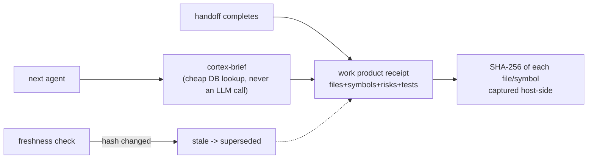

# Work Product Memory: never rediscover finished work

**What it answers:** *what did the last worker actually change, why, and can I trust that
picture right now — without re-reading the code?*

## What it is

A structured receipt written **once** at completion and projected **many** times: files and
symbols touched, subjects, behaviour and architecture notes, tests, risks, follow-ups —
with provenance back to the handoff that produced it.



## Why it exists

The **re-discovery tax**: without receipts, every agent's first hour on touched code is
spent re-reading what the previous agent already understood — and "completion amnesia"
means the *why* evaporates at handoff. The design rule that came with it (the
**No Re-Discovery Contract**): query `cortex-brief` *before* reading code; assimilation
cost must stay under ~5% of completion spend. Repeated full-code rereads for a current
work product is a workflow failure, not diligence.

Freshness is mechanical, not aspirational: file/symbol hashes are captured at creation
(host-side — the API container cannot see host files), and a changed hash *stales the
brief*. Newer work products supersede older ones. A brief that cannot be trusted says so.

## How to use it

```bash
cortex-work-product --handoff <id> ...        # write the receipt at completion
cortex-brief --handoff <id>                   # before touching code: what changed, why
cortex-brief "auth middleware"                # by free text / file / symbol
cortex-work-product --check-freshness         # hashes vs host files
```

## What to set up

Nothing extra — schema + API. The discipline is the setup: receipts at every completion
(the handoff return is the natural moment), briefs before every dig.

## Limits (honest)

- Freshness sees **content hashes**, not semantics — a rename can stale more than it
  should, a behaviour-preserving rewrite exactly as much as it should.
- Activity types extend beyond code (content/approval/campaign) but the hashing story is
  file-shaped; non-file work products carry receipts without freshness.
- A receipt is testimony plus verification hooks, not proof — pair it with
  `cortex-verify` when a claim matters.

## Sources

Design + Ren token-cost fold (`ARCHITECTURE.md` §Work Product Memory, 2026-06-14, kai
research + ren consult); shipped with `722f622f` (2026-06-18); projections `4ca9f763`;
6-type memory taxonomy grounded in CoALA/MemGPT/Graphiti/LightRAG/Mem0/PROV-O lineage.
