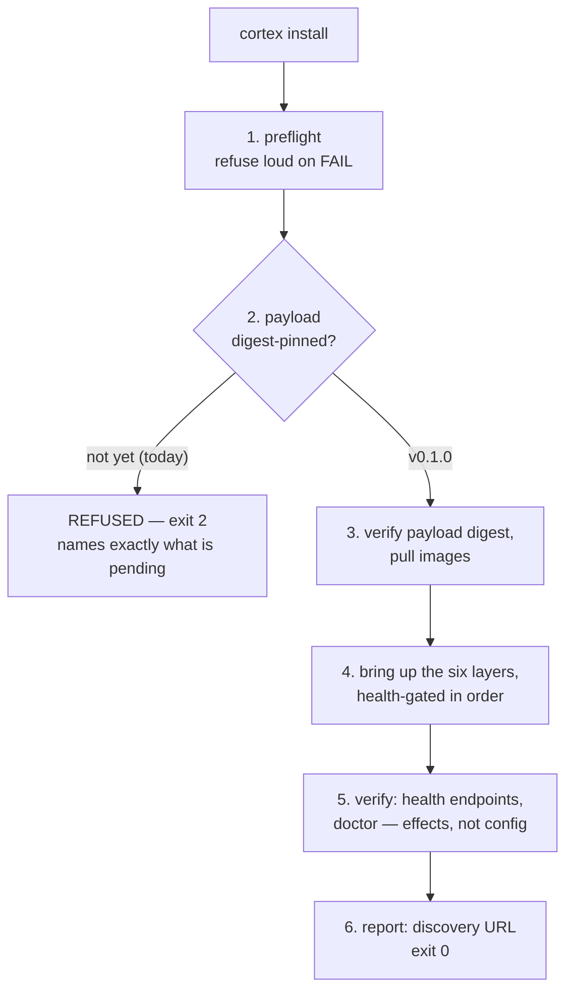

# Deployment process — the install stream

**What it answers:** *"How does Cortex get onto a machine, and how do we know it actually worked?"*

## What it is

Cortex ships as **one launcher behind three install channels**. The launcher is a single
dependency-free file (`packages/installer/bin/cortex.js`) that behaves identically under
node ≥ 18 and bun, from a brew wrapper, `npx`, or `bunx`. There is exactly one
implementation, one artifact, and therefore **zero divergence** between channels — a
behaviour difference between channels is an install-stream bug by definition.

| Channel | Command | Status |
|---|---|---|
| **brew** | `brew install kaidera-ai/kaidera/cortex` | Formula follows the shipping `kaidera-os.rb` tap pattern; lands with v0.1.0 |
| **npm** | `npx @kaidera-ai/cortex preflight` | Package scaffolded and pushed to the repo; **publish gated on v0.1.0** |
| **bun** | `bunx @kaidera-ai/cortex preflight` | Same artifact as npm; verified running under bun locally |

The launcher today exposes three commands:

| Command | Behaviour |
|---|---|
| `cortex preflight [--json]` | **Works today.** Checks this machine against the deployment contract and reports honestly. |
| `cortex install` | **Refuses loudly (exit 2) until the v0.1.0 payload exists** — names exactly what is pending. |
| `cortex version` / `cortex help` | Version and usage. |

## Why it exists (the history)

The install stream realises the platform-era **DISPATCHER.md contract**: one `cortex`
binary as the single dispatcher for the platform, with every entry point routing through
it. The extraction to `github.com/Kaidera-AI/cortex` (ROADMAP.md — v0.1.0 is the clean
import of the production Cortex from Kaidera OS) made that contract public-facing: three
channels had to resolve to the same payload, or the "one binary" promise would be theatre.

Two production lessons are built in, because we paid for them:

1. **A published launcher never pretends.** `install` ships ahead of the payload so
   channels and preflight can be proven early — but until the release pipeline flips
   `PAYLOAD` to a digest-pinned artifact, `install` refuses with exit 2 and names the
   missing piece. It will never deploy a stack it cannot verify by digest.
2. **Fail loud, never degraded.** The engine checks exist because the failures were
   measured: `podman update --restart` does not exist before podman 5.0 (Ubuntu 24.04
   ships 4.9.3 — too old); without systemd cgroups, healthcheck timers never schedule and
   every `service_healthy` waits forever; a mixed-engine machine is a support tar-pit.
   The Linux checks are byte-identical to the commands measured live on kos26.

## How it works

### Preflight

`cortex preflight` checks this machine against the deployment contract and changes
nothing:

- **macOS** — Apple Container present (`container --version`), its services running
  (`container system status`), and **no second engine**: if podman is also installed,
  preflight FAILs and names the remedy (remove podman — macOS runs Apple Container for
  everything).
- **Linux** — podman ≥ 5.0, cgroup manager `systemd`, rootless, and linger enabled
  (`loginctl show-user <uid> -p Linger`), so the stack survives reboot without a login.
  Missing podman short-circuits the rest — everything else depends on the engine.
- **Anything else** — named refusal: Cortex supports macOS (Apple Container) and Linux
  (rootless podman).

Every check reports its name, pass/fail, the observed detail, and — on failure — the
exact remedy. Exit **0 = PASS**, exit **1 = FAIL** (with "nothing was changed"). `--json`
emits the same checks machine-readably.

**Proven:** preflight PASS on Apple Container 1.1.0 — services running, no second engine
(podman removal is now an enforced check, not a suggestion).

### Install flow



1. **Preflight** — the same checks as above; a FAIL stops the install before anything
   changes.
2. **Payload gate** — the launcher deploys only a release artifact it can verify by
   digest. Until the v0.1.0 payload (wheel + images + compose) is published with digests,
   this is where `install` refuses: exit **2**, naming exactly what is pending.
3. **Pull** — fetch the digest-pinned payload and images; a channel that cannot prove the
   digest refuses to install.
4. **Bring up the stack** — the six layers, health-gated in order: `db` → `migrate` →
   `cortex-api` → `embed-worker` · `graph-worker` · `pdf-worker`. A service is up when its
   probe answers, not when its container starts. Only `cortex-api` is published to the
   host (`127.0.0.1:8501`); workers and Postgres stay on the internal network.
5. **Verify** — see below.
6. **Report** — prints the discovery URL
   (`http://127.0.0.1:<port>/.well-known/cortex`), the machine-readable "what can this
   Cortex do".

**Exit codes:** `0` = success; `2` = pending, with the reason named (today: the v0.1.0
release payload does not exist yet). `1` = preflight failure, fix and re-run.

### Verification — never pretends

Verification is by **digest and by effect**, never by configuration:

- **Digest** — every channel resolves to the same payload digest; the launcher installs
  only what it has verified. No digest, no deploy.
- **Effect** — after the stack is up, the launcher checks health endpoints and runs the
  doctor, which asks "does search return the row just written", never "does the config
  exist". (The config-check failure mode is measured, not hypothetical: `systemctl show`
  on a nonexistent unit synthesises `Result=success` — kos26, systemd 259.) On Linux,
  reboot-recovery arming is verified by the last run's actual result, not by "enabled".

Re-verify any time with `cortex-doctor`.

### Engine rules

**One containerisation technology per machine.** macOS runs Apple Container for
everything; Linux runs rootless podman for everything. No mixing, no aliases, no
fallbacks — a second engine on the machine is an install-stream refusal, enforced by
preflight. Nothing in install or repair may require sudo or a password; every path is
user-owned.

## How to use it

```bash
# any channel — same launcher, same behaviour
brew install kaidera-ai/kaidera/cortex   # (lands with v0.1.0)
npx  @kaidera-ai/cortex preflight        # (publishes with v0.1.0)
bunx @kaidera-ai/cortex preflight        # same artifact

cortex preflight          # PASS/FAIL with named remedies; nothing changed
cortex install            # deploys the six-layer appliance, or refuses naming why
cortex-doctor             # re-verify effects any time after install
```

### Rollbacks

Two rollback paths, both explicit operator acts — nothing rolls back silently:

- **Native console restore** — restore the deployment from the console's own backup:
  data rollback means restoring a dump. Downgrades are not otherwise supported.
- **Container rollback** — `cortex install --rollback` returns the containerised stack
  to the previously deployed digest-pinned payload: the launcher re-deploys the prior
  verified artifact and re-runs verification (health endpoints + doctor) before calling
  the rollback done. A rollback it cannot verify by digest is refused, same rule as
  install.

## What to set up

### Publish gating

- **npm publish is gated on v0.1.0.** The `@kaidera-ai/cortex` package is scaffolded and
  pushed to the repo; it publishes only with the release, after maintainer go.
- **First publish creates the `@kaidera-ai` npm org.** That is a one-time outward act —
  it names the organisation publicly — so it is gated on explicit operator go, not on CI.
- The **brew formula** lands with the same release, following the shipping
  `kaidera-os.rb` tap pattern, so all three channels appear together and resolve to the
  same digest.

### UAT runbook

The full sequence, in order — each step gates the next:

1. **Adjudicate findings** — every open review finding is accepted, fixed, or explicitly
   deferred with a named owner. No silent carry-over.
2. **Green gates** — the full gate suite passes on the release candidate.
3. **Package** — build the digest-pinned v0.1.0 payload (wheel + images + compose);
   record the digests.
4. **kos26 rebuilt from blank** — wipe the Linux reference machine and install from
   nothing through the real channel. Preflight, install, doctor — all must pass on a
   machine with no history.
5. **Mac Cortex stack verify** — same proof on macOS under Apple Container: preflight
   (including the no-second-engine check), install, doctor, discovery URL answers.
6. **One message** — a single report containing: the URLs, the payload digests, what
   passed, and what is not covered. "Not covered" is a first-class section — a UAT that
   hides its gaps has failed its purpose.

## Limits (honest)

- **`install` does not deploy today.** Exit 2 is the correct, honest behaviour until the
  v0.1.0 payload exists. Do not "fix" the refusal.
- **Preflight proves the machine, not the network.** Registry reachability and digest
  availability are install-time checks.
- **Rollback restores the previous verified payload, not arbitrary versions.** Downgrades
  beyond that mean restoring a dump — an explicit operator act.
- **Two platforms only.** macOS (Apple Container) and Linux (rootless podman). Anything
  else is a named refusal, not a degraded install.
- **bun support is verified locally**, not yet CI-gated end-to-end across all three
  channels; the channel table is the truth on status.

## Sources

- Launcher + contract: `packages/installer/bin/cortex.js` (design 23 §5d — "a published
  launcher must never pretend"), `packages/installer/README.md`, `packages/installer/package.json`.
- Platform contracts: `docs/install-macos.md`, `docs/install-linux.md`,
  `docs/deployment.md`, `ROADMAP.md` (v0.1.0 — the extraction), `CHANGELOG.md`.
- Measured evidence: Apple Container 1.1.0 preflight PASS; Linux checks byte-identical to
  commands measured live on kos26 (systemd 259); the DISPATCHER.md platform-era contract
  (one cortex binary, one launcher, zero divergence).
