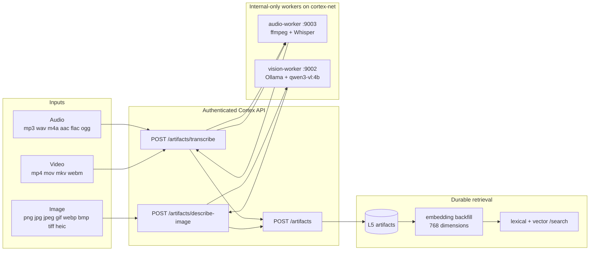

# Multimodal Ingestion: Audio, Images and Video

> **Question this answers:** can Cortex ingest media through one supported path and retrieve
> the result semantically?

**Yes in the current Kaidera OS source contract.** Audio and video audio tracks are
transcribed by the internal Whisper worker; images are described by the internal
Ollama/VLM worker; all three persist through the typed L5 artifact API and enter embedding
backfill. Managed-runtime/release qualification is still held, and video visuals or
keyframes are not analysed.

> **Standalone status:** v0.1.0 extraction is still in progress. This page documents the
> source contract being extracted. A command or profile is available from this repository
> only after discovery and the published payload expose it.

## The one-path architecture

There used to be two competing implementations: host-installed Whisper/Ollama in the CLI,
and internal worker containers that only appeared in health output. The productionised
contract removes that split.



The public multipart routes require `X-Project` and a registered `X-Agent-Name`. They stream
the upload to an internal worker and normalise its response. The CLI then calls
`POST /artifacts`; no command writes the database directly.

The API does not depend on optional workers at startup. Core Cortex remains available when
the media profile is absent; a media request fails with a typed `502` instead of an empty
or fabricated result.

## Worker and profile contract

| Worker | Internal route | Default model | Persistent state | Compose profiles |
|---|---|---|---|---|
| `cortex-audio-worker` | `POST :9003/transcribe` | Whisper `base` | `/var/lib/cortex/models/whisper` | `multimodal`, `full` |
| `cortex-vision-worker` | `POST :9002/describe-image` | Ollama 0.33.2 + `qwen3-vl:4b` | `/var/lib/cortex/models/ollama` | `multimodal`, `full` |

Both services are exposed only on `cortex-net`; neither publishes a host port. A shared
`cortex-models` volume keeps downloaded models across recreation.

`multimodal` is a targeted source-Compose profile. `full` remains for existing operator
workflows and selects the same services. The current managed installer and Apple runtime
still hold media profiles pending target-specific image/runtime UAT; source Compose success
is not release approval.

```bash
# Authorised Linux source-qualification host only.
podman compose -f .agents/docker-compose.cortex.yml \
  --profile multimodal up -d cortex-audio-worker cortex-vision-worker

curl -H "X-Project: my-project" \
  "${CORTEX_API_URL:-http://localhost:8501}/workers/health"
```

## CLI use

All media wrappers share the same dispatcher and generic artifact writer.

```bash
# Audio. Model is optional; the worker default is base.
cortex-ingest-audio standup.m4a quill my-project
cortex-ingest-audio interview.wav quill my-project --model medium

# Deliberately bypass inference when an operator already has a transcript.
cortex-ingest-audio interview.wav quill my-project \
  --transcript-file interview.txt

# Image description.
cortex-ingest-image dashboard.png quill my-project \
  --prompt "Capture navigation, statuses, tables and visible labels"

# Video audio-track transcription.
cortex-ingest-video demo.webm quill my-project --model base

# The generic command infers the same media route from the extension.
cortex-ingest-artifact whiteboard.heic quill my-project
```

Common options include source type, customer/organisation IDs, section context, JSON
metadata, an optional complete artifact-edge tuple, and `--dry-run`. A supplied transcript
is recorded in metadata; it is not mislabelled as worker output.

## API use

```bash
# Transcribe audio or a video's audio track.
curl --fail --silent --show-error \
  -H "X-Project: my-project" -H "X-Agent-Name: quill" \
  -F "artifact=@demo.webm" -F "model=base" \
  "${CORTEX_API_URL:-http://localhost:8501}/artifacts/transcribe"

# Describe an image.
curl --fail --silent --show-error \
  -H "X-Project: my-project" -H "X-Agent-Name: quill" \
  -F "artifact=@dashboard.png" \
  -F "prompt=Describe visible status and navigation" \
  "${CORTEX_API_URL:-http://localhost:8501}/artifacts/describe-image"
```

Both routes return extracted `content`, model identity, modality, and extraction method.
The caller persists that result with `POST /artifacts`, including the SHA-256 of the source
file and any provenance metadata.

## Video details

For `.mp4`, `.mov`, `.mkv`, and `.webm`, the audio worker:

1. streams the upload to a temporary file;
2. runs ffmpeg with `-vn -ac 1 -ar 16000` to produce a mono 16 kHz WAV;
3. sends that WAV to Whisper;
4. deletes both temporary files;
5. returns modality `video` and `audio_extracted: true`.

This is audio-track understanding only. The current contract does not sample keyframes,
join visual events to transcript timestamps, or describe silent video.

## Durable artifact and vector retrieval

`POST /artifacts` upserts on `(project, source_file, content_hash)`, optionally creates an
`artifact_edges` relationship, and emits a team event. `raw_content` is limited to 120,000
characters with a loud truncation receipt.

Artifact backfill chooses the first non-empty value from:

1. `raw_content`;
2. `caption`;
3. `source_file`.

The artifact schema uses `vector(768)` and an HNSW cosine index. `cortex-embed --table all`
now includes artifacts, while `--table artifacts` targets only that backlog. Search retains
the existing lexical/trigram stage and adds semantic artifact candidates from the vector
stage.

## Acceptance

A green worker health response is not completion. For each modality, prove:

1. the public route rejects an unregistered writer;
2. the worker returns non-empty content for a real fixture;
3. `POST /artifacts` returns an artifact ID from the intended project;
4. embedding backlog processes that artifact without a dimension error;
5. `/search?type=artifacts` returns it through the semantic stage;
6. repeated ingest of the same file does not duplicate the row.

## Failure modes and limits

- Worker absence or upstream HTTP failure is a typed API failure. Core memory remains up.
- First vision use can be slow because Ollama pulls the model lazily.
- Whisper accuracy and latency depend on the selected model and the recording.
- Video with no usable audio track fails extraction; it does not become a false transcript.
- The API streams uploads between services, but worker inference is still resource-heavy.
- Media containers are not a substitute for Gem or another agent. They extract content;
  they do not reason about or autonomously act on it.
