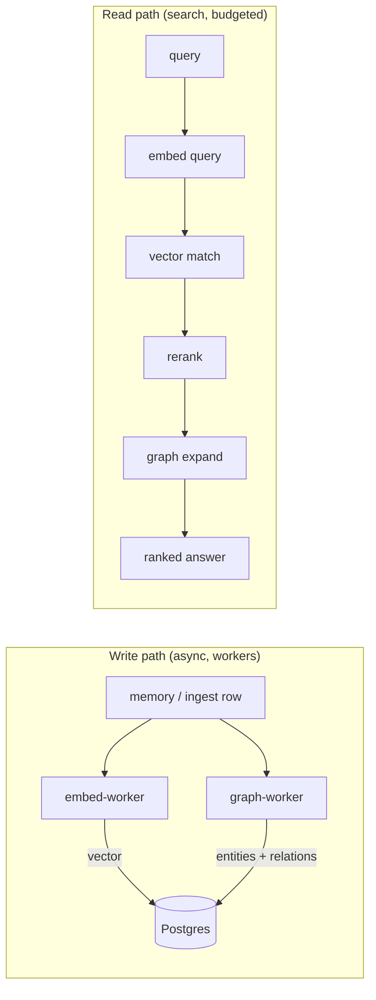

# Models: how Cortex uses embeddings and rerank

Cortex needs models in two places — neither is optional if you want search that works.

- **Embedding** runs twice: once per row at write time (enrichment, never blocking the
  write) and once per query at search time.
- **Rerank** re-orders the vector candidates by actual relevance. It is the difference
  between "similar words" and "the right answer".

Two production lessons are designed into v0.1.0, because we paid for them:

1. **Rerank must run or say it didn't.** In an earlier build, rerank sat last inside a
   fixed search-time budget — and was silently dropped on every query. Search "worked",
   degraded, for weeks. The `/degradation` endpoint exists so this state is loud.
2. **Provider model ids are exact strings.** OpenRouter's free rerank models require the
   `:free` suffix; without it every rerank call fails and (see lesson 1) used to fail
   silently.

## Choosing providers: the ladder

### 1. Self-hosted — Ollama

Private, free, offline. Run Ollama on the same host, pick an embedding model
(`nomic-embed-text`, `mxbai-embed-large`, `qwen3-embedding` are good starting points), and
point Cortex at it. Right when data cannot leave the machine, or for development.
Trade-off: quality tracks the local model, and embedding backfills are CPU/GPU-bound on
your hardware.

### 2. Free hosted — NVIDIA and friends

No hardware, no bill, real quality: **NVIDIA NIM's** free tier serves strong embedding and
rerank models (e.g. the `nv-embedqa` / reranker families) behind an OpenAI-compatible API.
Other free tiers work the same way. Right for trying Cortex seriously without a
subscription. Trade-off: rate limits — fine for a team's memory, felt during large
backfills.

### 3. Performance — OpenRouter

One key, every serious embedding/rerank/LLM provider behind one OpenAI-compatible API,
pay-as-you-go. This is what we run in production. Right when search quality and backfill
throughput matter. Remember the `:free` suffix rule if you use its free-tier model ids.

## Configuration

All three are entries in the same provider settings file (one file, one schema — see
[providers-standalone.md](providers-standalone.md) if OpenKai is not managing it):
base URL + model id + key (empty for local Ollama). Switching providers is editing the
file; re-embedding existing rows is `cortex-embed` (a backfill whose *effect* is verified —
a `--dry-run` proves nothing, another paid-for lesson).
