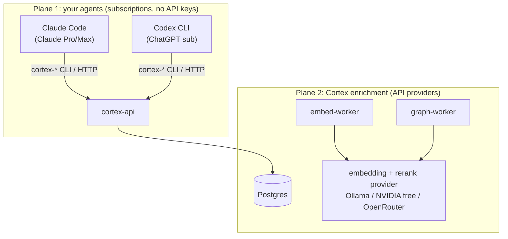

# Providers on a standalone Cortex (no OpenKai, no Kaidera OS)

You installed only Cortex. Two separate provider planes need thinking about — most
confusion comes from mixing them up:



## Plane 1 — your agents run on their subscriptions

The agents that *use* Cortex — Claude Code, Codex CLI, anything harness-shaped — carry
their own model access through their own subscriptions:

- **Claude Code** signs in with your **Claude Pro/Max** subscription. No Anthropic API key.
- **Codex CLI** signs in with your **ChatGPT** subscription. No OpenAI API key.

Cortex needs nothing from this plane except HTTP reachability: the agent runs `cortex-boot`,
`cortex-log`, `cortex-handoff`, `cortex-search` as CLI calls against `CORTEX_URL` with a
`CORTEX_TOKEN`. Your subscription pays for the agent's thinking; Cortex just remembers it.
Generated harness files (see [discovery](discovery.md)) mean an agent opening the project
directory already knows all of this.

## Plane 2 — Cortex's own enrichment needs an API provider

Embedding and rerank (and LLM-assisted graph extraction, if enabled) are API calls Cortex
makes itself. Subscriptions do not cover these — they need an endpoint. Pick a rung from
the ladder in [models.md](models.md): Ollama (self-hosted) · NVIDIA free tier ·
OpenRouter (recommended for performance).

## The settings file

One file, one schema, one location — the same contract whether OpenKai wrote it or Cortex
did ([architecture](architecture.md)). Without OpenKai, the installer soft-prompts once,
then on skip materialises the file from its pinned template. Fill in your enrichment
provider:

```jsonc
// provider settings (schema owned by OpenKai; identical file either way)
{
  "providers": {
    "embedding": { "base_url": "http://127.0.0.1:11434", "model": "nomic-embed-text", "api_key": "" },
    "rerank":    { "base_url": "https://openrouter.ai/api/v1", "model": "<id>", "api_key": "sk-or-..." }
  }
}
```

Rules that hold regardless of choice:

- **Keys live in the settings file, never in code, never in Cortex's database.**
- **Never hand-maintain two copies.** One file; every reader reads it.
- **Verify the effect**: after configuring, `cortex-doctor` must show search answering and
  the embedding backlog draining. A configured-looking file that nothing consumes is the
  most expensive failure mode we know.
- Installing OpenKai later? It **adopts** this exact file and becomes its author. Nothing
  else changes.
